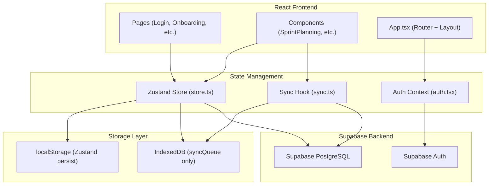
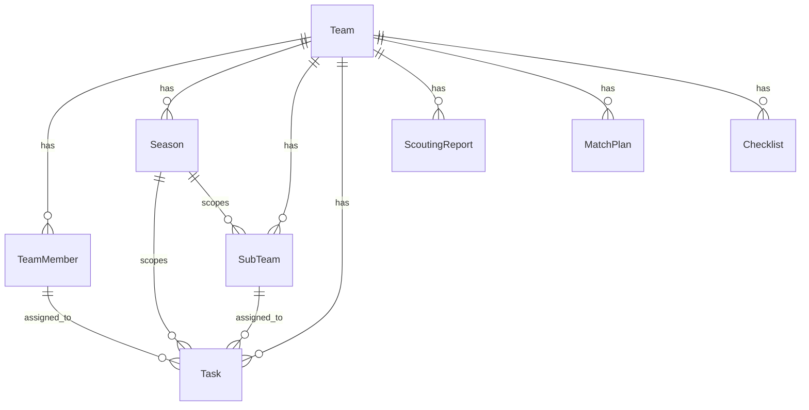

# FalconForge Architecture Skill

Read this skill before making any significant changes to the FalconForge application. This documents how all the pieces fit together.

## Architecture Overview



## Core Files

| File | Purpose | Key Exports |
|------|---------|-------------|
| `src/lib/store.ts` | Zustand store - ALL app state | `useAppStore` |
| `src/lib/auth.tsx` | Auth context + Supabase auth | `useAuth`, `AuthProvider` |
| `src/lib/sync.ts` | Sync queue + online/offline | `useSync`, `useOnlineStatus` |
| `src/lib/offline-db.ts` | IndexedDB via Dexie | `db`, `queueForSync` |
| `src/lib/supabase.ts` | Supabase client | `supabase`, `isSupabaseConfigured` |
| `src/App.tsx` | Router + Dashboard layout | Main component |

## Data Flow

### 1. Authentication Flow
```
Login.tsx -> useAuth().signInWithEmail() -> Supabase Auth 
  -> onAuthStateChange -> ensureUserProfile() -> users table
  -> Navigate to /onboarding -> Onboarding.tsx
  -> Select team -> Navigate to Dashboard
```

### 2. Team Data Loading Flow
```
App.tsx useEffect -> fetchTeamData(teamId) in store.ts
  -> Supabase queries for: team_members, seasons, sub_teams, tasks, 
     scouting_reports, match_plans, checklists
  -> Updates Zustand store state
  -> Components re-render with new data
```

### 3. Data Modification Flow (e.g., addTask)
```
SprintPlanning.tsx -> store.addTask(taskData)
  -> store.ts addTask:
     1. Generate ID
     2. Update local state (set(tasks: [...]))  
     3. Call queueForSync() to add to IndexedDB sync queue
  -> SyncStatusIndicator shows "1 pending"
```

### 4. Sync Flow
```
User clicks Sync button OR pendingChanges > 0 with isOnline
  -> sync.ts useSync().sync()
  -> Get all items from db.syncQueue
  -> For each item: processSyncItem() -> Supabase upsert/update/delete
  -> On success: remove from queue
  -> On failure: increment retryCount (max 5, then discard)
  -> pullChangesFromServer() -> fetch updated records from Supabase
  -> Update localStorage sync timestamps
```

### 5. Sign Out Flow
```
User clicks Sign Out -> Navigation / Sidebar / AdminSettings
  -> auth.tsx useAuth().signOut()
  -> supabase.auth.signOut()
  -> store.resetToDefaults()  (Clears Zustand state)
  -> clearLocalDatabase()     (Clears IndexedDB sync queue)
  -> localStorage.removeItem('falconforge-storage')
  -> localStorage.removeItem('falconforge-sync-timestamps')
  -> Redirect to /login
```

## Entity Relationships



## Components & Their Store Dependencies

| Component | Store State Used | Store Actions Used |
|-----------|-----------------|-------------------|
| `SprintPlanning` | tasks, subTeams, teamMembers | addTask, updateTask, deleteTask |
| `PreMatchChecklist` | checklist | toggleChecklistItem, resetChecklist, addChecklistItem |
| `ScoutingReports` | scoutingReports | addScoutingReport, deleteScoutingReport |
| `MatchPlanner` | matchPlans | (local state, syncs via store) |
| `AdminSettings` | teamMembers, subTeams, seasons | setTeamMembers, addSubTeam, setSeasons |
| `SyncStatusIndicator` | (via useSync hook) | sync() |
| `DashboardHome` | tasks, scoutingReports | (read-only) |

## Critical Integration Points

### 1. Supabase Configuration
- **Required env vars**: `VITE_SUPABASE_URL`, `VITE_SUPABASE_ANON_KEY`
- **Check**: `isSupabaseConfigured()` returns true/false
- **Impact**: If not configured, sync won't work, auth won't work

### 2. IndexedDB (Dexie)
- **Database name**: `FalconForgeDB`
- **Tables**: `syncQueue` (Entity tables were removed in v2 schema)
- **Key function**: `queueForSync()` adds items to sync queue

### 3. localStorage Keys
- `falconforge-storage`: Zustand persisted state
- `falconforge-sync-timestamps`: Last sync times per entity
- `sb-xxxxx-auth-token`: Supabase auth token

## Known Gotchas & Architectural Quirks

### LocalStorage vs IndexedDB
- **State vs Queue:** Application data (tasks, teams, etc) is stored in the Zustand store and persisted synchronously to `localStorage`. Only the **network queue** (`syncQueue`) uses `IndexedDB`.
- **Storage Limits:** LocalStorage has a ~5MB limit. This is generally fine for text-heavy data, but the SVG drawing data in `match_plans` could eventually hit this limit.

### Sequential Data Loading
The `fetchTeamData` function in `store.ts` loads tables sequentially rather than in parallel. While technically slower, it prevents Supabase's JS client from stumbling over itself when many requests are fired off instantaneously upon connection restoration.

## Test Infrastructure

All tests use **Vitest** + **Testing Library** (no E2E/Playwright). Tests are mandatory — all code changes must pass before being considered complete.

| Type | Location | Command |
|------|----------|---------|
| Unit/Component | `src/**/__tests__/*.test.ts(x)` | `npm run test:run` |
| Integration | `src/**/__tests__/*.integration.test.ts` | `npm run test:integration` |
| All | — | `npm run test:all` |

Key test files:
- `src/lib/__tests__/store.test.ts` — Store actions (tasks, checklist, scouting, etc.)
- `src/components/__tests__/Dashboard.test.tsx` — Navigation, role-based rendering, sign-out
- `src/components/__tests__/SyncStatusIndicator.test.tsx` — All sync states
- `src/lib/__tests__/store-sync.integration.test.ts` — Store → sync queue
- `src/lib/__tests__/data-transform.integration.test.ts` — camelCase ↔ snake_case

## Component Size Limits & Splitting

1. **Maximum Component Size:** ~300 lines limit for UI components.
2. **Maximum Store Size:** ~400 lines limit before splitting into domain-specific Zustand slices.
3. **When to Split Components:** If rendering multiple inline sub-views or managing distinct domain objects.
4. **Where to Move Sub-components:** Flat `src/components/` is usually fine, or encapsulate in a subdirectory if 3+ related sub-components exist.
*Consult `.agent/skills/component-decomposition/SKILL.md` for specific instructions.*

## When to Add New Skills

Consider creating a new skill when:
1. **New subsystem**: Adding a new major feature (e.g., chat, notifications)
2. **Complex API integration**: Adding a new external service
3. **Recurring patterns**: Something you've done 3+ times the same way
4. **Production requirements**: Deployment, monitoring, database migrations
