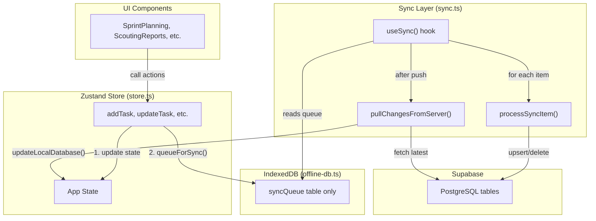

# Data Sync Skill

This skill documents the complete data synchronization flow between IndexedDB, the Zustand store, and Supabase. **Read this before making any changes to data handling code.**

## Architecture Overview



## The Two-Phase Sync Process

### Phase 1: Push Local Changes
1. User action calls store action (e.g., `addTask()`)
2. Store updates local state immediately
3. Store calls `queueForSync()` to add item to sync queue
4. User sees updated UI instantly (optimistic update)

### Phase 2: Pull Remote Changes
1. After pushing all queue items, `pullChangesFromServer()` runs
2. Fetches records updated since last sync timestamp
3. Transforms data from snake_case to camelCase
4. Updates Zustand store with `set()` calls

## Key Files

| File | Purpose |
|------|---------|
| `src/lib/offline-db.ts` | IndexedDB database, `queueForSync()` function |
| `src/lib/sync.ts` | `useSync()` hook, sync processing logic |
| `src/lib/store.ts` | Zustand store with sync-aware actions |

## Store Action Pattern

Every store action that modifies data should follow this pattern:

```typescript
addTask: (taskData) => {
    const teamId = get().currentTeamId;
    const seasonId = get().currentSeasonId;
    
    // 1. Generate ID
    const id = generateId();
    
    // 2. Create the entity
    const task: Task = {
        id,
        ...taskData,
        createdAt: Date.now(),
    };
    
    // 3. Update local state IMMEDIATELY (optimistic update)
    set((state) => ({ tasks: [...state.tasks, task] }));
    
    // 4. Queue for sync (async, fire-and-forget)
    queueForSync('tasks', id, 'create', {
        ...task,
        teamId,
        seasonId,
    });
}
```

## Data Transformation

### Local (camelCase) → Supabase (snake_case)

The `transformToSupabaseSchema()` function in `sync.ts` handles this:

| Local Field | Supabase Column |
|-------------|-----------------|
| `teamId` | `team_id` |
| `assignedTo` | `assigned_to` |
| `createdAt` | `created_at` |
| `dueDate` | `due_date` |
| `subTeamId` | `sub_team_id` |

### Complex Fields

Some fields require special handling for metadata mapping, but **arrays and objects can be passed directly to Supabase JSONB columns**; you do NOT need to use `JSON.stringify()`.

```typescript
// Tasks: checklist and timeline are JSON columns. No stringification needed.
{
    checklist: data.checklist,
    timeline: data.timeline,
    tags: data.tags,
}

// Checklists: items is a JSON column. No stringification needed.
{
    items: data.items,
}
```

### Supabase (snake_case) → Local (camelCase)

The `updateLocalDatabase()` function handles the reverse:

```typescript
// Example: scouting_reports table → scoutingReports store
teamNumber: record.opponent_team_number,
matchNumber: record.match_number,
hasAutonomous: record.data?.hasAutonomous,
```

## Sync Queue Item Structure

```typescript
interface SyncQueueItem {
    id: string;           // Unique queue item ID
    tableName: string;    // 'tasks', 'checklists', etc.
    recordId: string;     // ID of the entity being synced
    operation: 'create' | 'update' | 'delete';
    data: any;            // Full entity data for create/update
    timestamp: number;    // When queued
    retryCount: number;   // Failed attempts (max 5)
    lastError?: string;   // Last error message
}
```

## Sync Timing

| Event | What Happens |
|-------|--------------|
| User clicks Sync button | Full sync: push queue + pull changes |
| App comes online | Auto-sync if pendingChanges > 0 |
| Timeout after 30 seconds | Sync aborts, shows error |

## Common Pitfalls

### 1. Forgetting to Queue for Sync

**Wrong:**
```typescript
set((state) => ({ tasks: [...state.tasks, task] }));
// Missing queueForSync call!
```

**Right:**
```typescript
set((state) => ({ tasks: [...state.tasks, task] }));
queueForSync('tasks', task.id, 'create', { ...task, teamId });
```

### 2. Missing teamId in Sync Data

All synced entities must include `teamId`:

```typescript
queueForSync('tasks', id, 'create', {
    ...task,
    teamId,  // REQUIRED for Supabase RLS
    seasonId,
});
```

### 3. Not Handling Concurrent Edits

If user edits the same entity on two devices:
- The later sync "wins" (last-write-wins)
- No merge happens
- Consider adding `localVersion` tracking for important entities

### 4. Sync Hanging Forever

The sync has a 30-second timeout. If individual Supabase queries hang, the whole sync fails. Check:
- Network connectivity
- Supabase query performance
- Large data payloads

## Debugging Sync Issues

### Check Sync Queue
```typescript
// In browser console:
const items = await window.db?.syncQueue.toArray();
console.log('Pending sync items:', items);
```

### Check Supabase Response
Add logging in `processSyncItem()`:
```typescript
console.log('Syncing:', item.tableName, item.operation, item.recordId);
const { data, error } = await supabase.from(table).upsert(transformed);
console.log('Result:', { data, error });
```

### Check Data Transformation
Compare local entity with Supabase table schema to ensure fields map correctly.

## Testing Sync Code

### Unit Tests (Mock Everything)
- Test data transformation functions
- Test queue operations

### Integration Tests (Real IndexedDB, Mock Supabase)
- Test that store actions queue items correctly
- Test that queue items have correct structure

### Component Tests (Mock Store)
- Test that UI components display sync state correctly
- Test SyncStatusIndicator shows correct states (synced, pending, error, offline)

## Critical Safety Rules (MUST FOLLOW)

These rules prevent recurring data sync bugs. **Violating any of these will cause data staleness, UI freezes, or broken sign out.**

### 1. Always Use `withTimeout()` for Supabase Calls

Every Supabase query in sync code MUST be wrapped with `withTimeout()` (exported from `sync.ts`):

```typescript
import { withTimeout } from './sync';

const result: any = await withTimeout(
    supabase.from('tasks').select('*').eq('team_id', teamId),
    10_000,  // 10s per-query timeout
    'pull tasks'
);
```

The overall sync operation has a 30-second timeout. Individual queries have 10-second timeouts.

### 2. Never Use `db.delete()` for Sign Out

`db.delete()` destroys the Dexie database instance permanently. Use `clearLocalDatabase()` instead:

```typescript
// ❌ WRONG - breaks subsequent IndexedDB operations
await db.delete();

// ✅ CORRECT - clears tables but keeps Dexie instance alive
import { clearLocalDatabase } from './offline-db';
await clearLocalDatabase();
```

### 3. Sign Out Must Call `resetToDefaults()` First

The store's `resetToDefaults()` must be called BEFORE `signOut()` to prevent the sync queue from receiving new items during teardown:

```typescript
const handleSignOut = async () => {
    useAppStore.getState().resetToDefaults();  // 1. Stop sync
    await signOut();                            // 2. Auth logout
    await clearLocalDatabase();                // 3. Clear sync queue
    await clearAppState();                     // 4. Clear persisted state (IndexedDB)
    localStorage.removeItem('falconforge-sync-timestamps'); // 5. Clear metadata
    window.location.href = '...login';         // 6. Redirect
};
```

### 4. `resetToDefaults()` Must Clear ALL State

When modifying `resetToDefaults()`, ensure it clears:
- `currentTeamId`, `teams` (prevents stale team context)
- `seasons`, `currentSeasonId` (prevents stale season data)
- `portfolioHistory` (prevents stale portfolio)
- `isLoading` (prevents stuck loading states)

### 5. Empty Results from Server ARE Valid

`pullChangesFromServer()` MUST update local state even when the server returns empty results. This is how cross-client deletions propagate:

```typescript
// ❌ WRONG - deletions from other clients are never reflected
if (data && data.length > 0) {
    updateLocalDatabase(localTable, data);
}

// ✅ CORRECT - empty results clear local data (deletion propagation)
updateLocalDatabase(localTable, data || []);
```

### 6. Avoid Stale Closures in `useCallback`

Don't capture mutable state like `isOnline` in `useCallback` dependencies. Read `navigator.onLine` directly:

```typescript
// ❌ WRONG - isOnline becomes stale
const sync = useCallback(async () => {
    if (!isOnline) return;
}, [isOnline]);

// ✅ CORRECT - reads current value
const sync = useCallback(async () => {
    if (!navigator.onLine) return;
}, []);
```

### 7. Loading Screens Must Have Timeouts

Any screen that shows "Loading..." while waiting for Supabase MUST have a safety timeout:

```typescript
const loadTimeout = setTimeout(() => setIsLoading(false), 8000);
```

## When to Create New Sync-Enabled Entities

1. Define the TypeScript interfaces in `types.ts` or `store.ts`
2. Add store state and actions in `store.ts`
3. Add store state and actions in `store.ts`
4. Add transformation cases in `sync.ts`:
   - `transformToSupabaseSchema()`
   - `updateLocalDatabase()`
5. Add entity pull in `pullChangesFromServer()`
6. Create corresponding Supabase table (migration)
7. **Write integration tests for the new sync flow**
8. **Write component tests for any new UI that displays the data**

