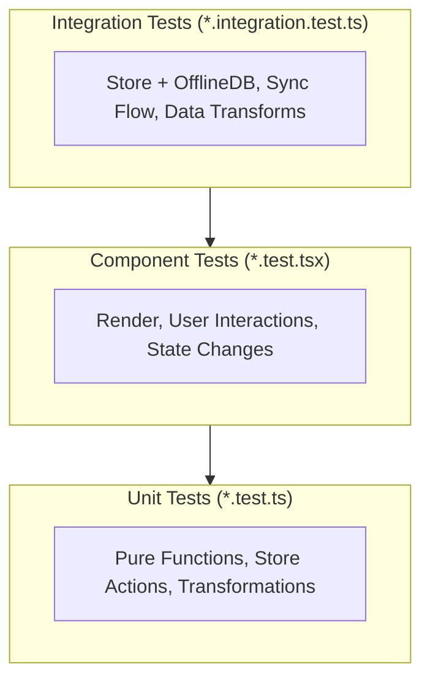

# Testing Strategy Skill

This skill documents the testing approach for FalconForge. The project uses **Vitest** for all tests — there are no E2E/Playwright tests.

## Testing Layers



| Type | Speed | What to Mock | Purpose |
|------|-------|--------------|---------| 
| Unit | Fast | Everything except the function under test | Test pure logic |
| Component | Fast | Store, auth, sync hooks | Test render + interactions |
| Integration | Medium | Only network calls (Supabase) | Test cross-module interactions |

## File Locations

| Type | Location | Naming |
|------|----------|--------|
| Unit Tests | `src/lib/__tests__/*.test.ts` | `store.test.ts` |
| Component Tests | `src/components/__tests__/*.test.tsx` | `AdminSettings.test.tsx` |
| Page Tests | `src/pages/__tests__/*.test.tsx` | `Login.test.tsx` |
| Integration Tests | `src/lib/__tests__/*.integration.test.ts` | `store-sync.integration.test.ts` |

## Running Tests

```powershell
# Unit + component tests
npm run test:run

# Integration tests (sync/data transforms only)
npm run test:integration

# All tests (unit + integration)
npm run test:all
```

## What to Mock vs. What to Test Real

### Unit/Component Tests
**Mock everything** that's not the function under test:
- ✅ Mock Supabase client
- ✅ Mock IndexedDB/Dexie
- ✅ Mock sync hooks (`useSync`)
- ✅ Mock store (use `vi.mock` + `mockImplementation`)
- ✅ Mock auth context (`useAuth`)

### Integration Tests
**Mock only network**, test real local interactions:
- ✅ Mock Supabase network responses
- ❌ Don't mock IndexedDB (use `fake-indexeddb`)
- ❌ Don't mock Zustand store
- ❌ Don't mock `queueForSync`

## Component Test Patterns

### Pattern 1: Basic Component Rendering

```typescript
import { describe, it, expect, vi, beforeEach } from 'vitest';
import { render, screen } from '@testing-library/react';
import MyComponent from '../MyComponent';
import { useAppStore } from '../../lib/store';

vi.mock('../../lib/store', () => ({
    useAppStore: vi.fn(),
}));

const mockStore = {
    // Add the state fields the component reads
    tasks: [{ id: '1', title: 'Test', status: 'To Do' }],
    // Add the actions the component calls
    addTask: vi.fn(),
};

describe('MyComponent', () => {
    beforeEach(() => {
        vi.clearAllMocks();
        (useAppStore as unknown as ReturnType<typeof vi.fn>).mockImplementation((selector) => {
            if (typeof selector === 'function') return selector(mockStore);
            return mockStore;
        });
    });

    it('renders component content', () => {
        render(<MyComponent />);
        expect(screen.getByText('Test')).toBeDefined();
    });
});
```

### Pattern 2: Testing User Interactions

```typescript
import { fireEvent } from '@testing-library/react';

it('calls store action when button is clicked', () => {
    render(<MyComponent />);
    
    fireEvent.click(screen.getByText('Add'));
    expect(mockStore.addTask).toHaveBeenCalled();
});
```

### Pattern 3: Testing Conditional Rendering (Role-Based)

```typescript
it('hides admin section for non-coach users', () => {
    // Override mock to return student role
    (useAppStore as unknown as ReturnType<typeof vi.fn>).mockImplementation((selector) => {
        const studentStore = { ...mockStore, currentUserRole: 'student' };
        if (typeof selector === 'function') return selector(studentStore);
        return studentStore;
    });
    
    render(<MyComponent />);
    expect(screen.queryByText('Admin Settings')).toBeNull();
});
```

## Integration Test Patterns

### Pattern 1: Store Action → Sync Queue

```typescript
import { describe, it, expect, beforeEach, vi } from 'vitest';
import { useAppStore } from '../store';
import { db } from '../offline-db';

vi.mock('../supabase', () => ({
    supabase: {
        from: vi.fn(() => ({
            select: vi.fn().mockReturnThis(),
            eq: vi.fn().mockResolvedValue({ data: [], error: null }),
        })),
    },
    isSupabaseConfigured: () => true,
}));

describe('Store → Sync Queue Integration', () => {
    beforeEach(async () => {
        await db.syncQueue.clear();
        useAppStore.setState({ currentTeamId: 'test-team', tasks: [] });
    });
    
    it('addTask queues item for sync', async () => {
        useAppStore.getState().addTask({
            title: 'Test Task',
            description: 'Test',
            status: 'To Do',
            type: 'Feature',
        });
        
        await new Promise(resolve => setTimeout(resolve, 100));
        
        const queueItems = await db.syncQueue.toArray();
        expect(queueItems).toHaveLength(1);
        expect(queueItems[0].tableName).toBe('tasks');
        expect(queueItems[0].operation).toBe('create');
    });
});
```

### Pattern 2: Data Transformation

```typescript
describe('transformToSupabaseSchema', () => {
    it('transforms camelCase to snake_case', () => {
        const input = { id: '123', teamId: 'team-1', assignedTo: 'member-1' };
        const result = transformToSupabaseSchema('tasks', input);
        
        expect(result.team_id).toBe('team-1');
        expect(result.assigned_to).toBe('member-1');
    });
});
```

## Test Naming Conventions

```typescript
describe('ComponentName', () => {
    describe('featureArea', () => {
        it('should [expected behavior] when [condition]', () => {
            // ...
        });
    });
});
```

Examples:
- `'should queue task for sync when addTask is called'`
- `'should render all navigation items for coach user'`
- `'should show "Synced" when idle with no pending changes'`

## Mandatory Testing Rules

1. **Every code change must pass `npm run test:run`** before being considered complete
2. **New components** must have a corresponding test file in `__tests__/`
3. **Modified components** must have their tests updated if behavior changed
4. **Sync-related changes** must also pass `npm run test:integration`
5. **Never skip failing tests** — fix the code or the test

## Debugging Test Failures

### Unit/Component Test Failures
1. Check mock setup matches what the code expects
2. Verify test isolation (state leaking between tests via `vi.clearAllMocks()`)
3. Use `screen.debug()` to see rendered output
4. For duplicate element matches, use `getAllByText()` instead of `getByText()`

### Integration Test Failures
1. Check IndexedDB state with `db.table.toArray()`
2. Verify mocked Supabase responses match real API structure
3. Add `await new Promise(r => setTimeout(r, 100))` for async operations
4. Check that `fake-indexeddb` is imported in setup files
