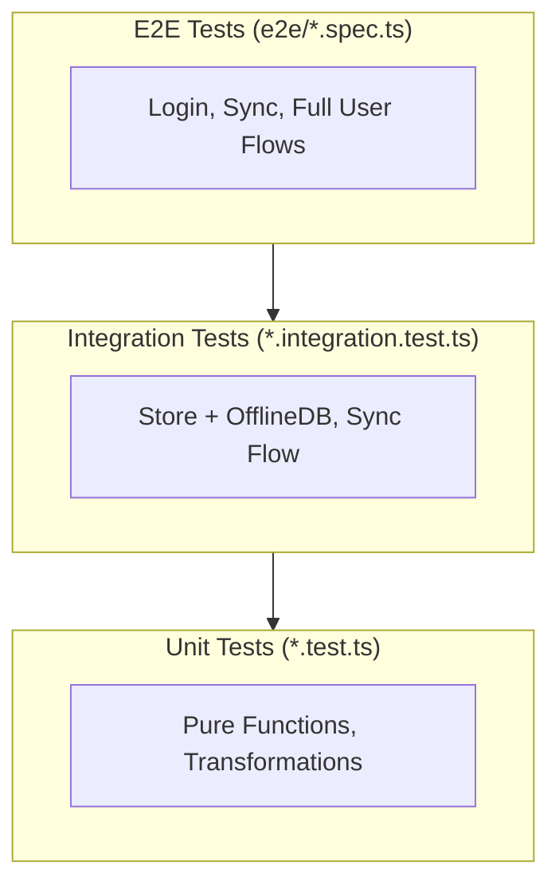

# Testing Strategy Skill

This skill documents the testing approach for FalconForge, with emphasis on testing the data sync layer effectively.

## Testing Pyramid



| Type | Speed | What to Mock | Purpose |
|------|-------|--------------|---------|
| Unit | Fast | Everything except the function under test | Test pure logic |
| Integration | Medium | Only network calls (Supabase) | Test component interactions |
| E2E | Slow | Nothing (maybe test database) | Test real user flows |

## File Locations

| Type | Location | Naming |
|------|----------|--------|
| Unit Tests | `src/**/__tests__/*.test.ts(x)` | `ComponentName.test.tsx` |
| Integration Tests | `src/**/__tests__/*.integration.test.ts` | `sync-integration.test.ts` |
| E2E Tests | `e2e/*.spec.ts` | `login.spec.ts` |

## What to Mock vs. What to Test Real

### Unit Tests
**Mock everything** that's not the function under test:
- ✅ Mock Supabase client
- ✅ Mock IndexedDB/Dexie
- ✅ Mock sync hooks
- ✅ Mock store (for component tests)

### Integration Tests
**Mock only network**, test real local interactions:
- ✅ Mock Supabase network responses
- ❌ Don't mock IndexedDB (use fake-indexeddb)
- ❌ Don't mock Zustand store
- ❌ Don't mock queueForSync

### E2E Tests
**Mock nothing** (or use test database):
- ❌ Don't mock anything
- Use real app running against real/test Supabase

## Integration Test Patterns

### Pattern 1: Store Action → Sync Queue

Test that store actions correctly queue items for sync:

```typescript
import { describe, it, expect, beforeEach, vi } from 'vitest';
import { useAppStore } from '../store';
import { db } from '../offline-db';

// Mock only the Supabase client
vi.mock('../supabase', () => ({
    supabase: {
        from: vi.fn(() => ({
            select: vi.fn().mockReturnThis(),
            eq: vi.fn().mockResolvedValue({ data: [], error: null }),
        })),
    },
    isSupabaseConfigured: () => true,
}));

describe('Store → Sync Queue Integration', () => {
    beforeEach(async () => {
        // Clear real IndexedDB tables
        await db.syncQueue.clear();
        await db.tasks.clear();
        
        // Reset store
        useAppStore.setState({
            currentTeamId: 'test-team',
            currentSeasonId: 'test-season',
            tasks: [],
        });
    });
    
    it('addTask queues item for sync', async () => {
        const store = useAppStore.getState();
        
        store.addTask({
            title: 'Test Task',
            description: 'Test',
            status: 'To Do',
            type: 'Feature',
            // ... other fields
        });
        
        // Wait for async queueForSync
        await new Promise(resolve => setTimeout(resolve, 100));
        
        // Check sync queue
        const queueItems = await db.syncQueue.toArray();
        expect(queueItems).toHaveLength(1);
        expect(queueItems[0].tableName).toBe('tasks');
        expect(queueItems[0].operation).toBe('create');
        expect(queueItems[0].data.teamId).toBe('test-team');
    });
});
```

### Pattern 2: Sync Processing

Test that sync items are processed correctly:

```typescript
describe('Sync Processing Integration', () => {
    it('processSyncItem transforms camelCase to snake_case', async () => {
        // Add item to queue
        await db.syncQueue.add({
            id: 'queue-1',
            tableName: 'tasks',
            recordId: 'task-1',
            operation: 'create',
            data: {
                id: 'task-1',
                teamId: 'team-1',
                assignedTo: 'member-1',
                dueDate: 1234567890,
            },
            timestamp: Date.now(),
            retryCount: 0,
        });
        
        // Mock Supabase to capture the payload
        let capturedPayload: any;
        vi.mocked(supabase.from).mockReturnValue({
            upsert: vi.fn().mockImplementation((data) => {
                capturedPayload = data;
                return { data, error: null };
            }),
        } as any);
        
        // Process sync
        await processSync();
        
        // Verify transformation
        expect(capturedPayload.team_id).toBe('team-1');
        expect(capturedPayload.assigned_to).toBe('member-1');
        expect(capturedPayload.due_date).toBe(1234567890);
    });
});
```

### Pattern 3: Pull Changes → Store Update

Test that pulling changes updates the store:

```typescript
describe('Pull Changes Integration', () => {
    it('pullChangesFromServer updates store with transformed data', async () => {
        // Mock Supabase response with snake_case
        vi.mocked(supabase.from).mockImplementation((table) => ({
            select: vi.fn().mockReturnThis(),
            eq: vi.fn().mockReturnThis(),
            gt: vi.fn().mockResolvedValue({
                data: [{
                    id: 'task-1',
                    team_id: 'team-1',
                    assigned_to: 'member-1',
                    created_at: '2024-01-01T00:00:00Z',
                }],
                error: null,
            }),
        } as any));
        
        await pullChangesFromServer();
        
        // Check store was updated with camelCase
        const tasks = useAppStore.getState().tasks;
        const task = tasks.find(t => t.id === 'task-1');
        expect(task?.assignedTo).toBe('member-1');
    });
});
```

## Unit Test Patterns

### Pattern: Data Transformation Functions

```typescript
describe('transformToSupabaseSchema', () => {
    it('transforms task correctly', () => {
        const input = {
            id: '123',
            teamId: 'team-1',
            assignedTo: 'member-1',
            createdAt: 1234567890,
            checklist: [{ id: '1', text: 'Item', completed: false }],
        };
        
        const result = transformToSupabaseSchema('tasks', input);
        
        expect(result.team_id).toBe('team-1');
        expect(result.assigned_to).toBe('member-1');
        expect(result.created_at).toBe(1234567890);
        expect(result.checklist).toBe(JSON.stringify(input.checklist));
    });
});
```

## E2E Test Patterns

### Pattern: Auth Setup (Shared Login)

```typescript
// e2e/auth.setup.ts
import { test as setup, expect } from '@playwright/test';

const authFile = 'playwright/.auth/user.json';

setup('authenticate', async ({ page }) => {
    await page.goto('/');
    await page.getByTestId('email-input').fill('jkfussell@gmail.com');
    await page.getByTestId('password-input').fill('scooby');
    await page.getByTestId('sign-in-button').click();
    
    // Wait for successful navigation
    await page.waitForURL(/(?!.*login).*/);
    
    // Save signed-in state
    await page.context().storageState({ path: authFile });
});
```

### Pattern: Reliable Selectors

Use `data-testid` attributes for reliable E2E selectors:

```typescript
// In component:
<button data-testid="sync-button">Sync</button>

// In test:
await page.getByTestId('sync-button').click();
```

### Pattern: Waiting for Async Operations

```typescript
// Bad: Fixed timeout
await page.waitForTimeout(2000);

// Good: Wait for specific condition
await expect(page.getByTestId('sync-status'))
    .toHaveText('Synced', { timeout: 15000 });
```

## Test Setup Configuration

### Integration Test Setup

Create `src/test/setup-integration.ts`:

```typescript
import 'fake-indexeddb/auto';
import { vi } from 'vitest';

// Only mock Supabase network calls
vi.mock('@/lib/supabase', () => ({
    supabase: createMockSupabase(),
    isSupabaseConfigured: () => true,
}));

// Don't mock offline-db - use real IndexedDB (fake-indexeddb)
// Don't mock store - use real store
```

### Vitest Integration Config

Create `vitest.config.integration.ts`:

```typescript
import { defineConfig } from 'vitest/config';

export default defineConfig({
    test: {
        include: ['src/**/*.integration.test.ts'],
        setupFiles: ['./src/test/setup-integration.ts'],
        environment: 'jsdom',
        // Longer timeout for async operations
        testTimeout: 10000,
    },
});
```

## Running Tests

```bash
# Unit tests only
npm run test:run

# Integration tests
npm run test:integration

# E2E tests
npm run test:e2e

# All tests
npm run test:all
```

## Test Naming Conventions

```typescript
describe('ComponentName', () => {
    describe('methodName', () => {
        it('should [expected behavior] when [condition]', () => {
            // ...
        });
    });
});
```

Examples:
- `'should queue task for sync when addTask is called'`
- `'should transform camelCase to snake_case for tasks'`
- `'should update store when pullChangesFromServer receives data'`

## Debugging Test Failures

### Unit Test Failures
1. Check mock setup matches what the code expects
2. Verify test isolation (state leaking between tests)
3. Console.log intermediate values

### Integration Test Failures
1. Check IndexedDB state with `db.table.toArray()`
2. Verify mocked Supabase responses match real API
3. Add `await new Promise(r => setTimeout(r, 100))` for async operations

### E2E Test Failures
1. Run with `--debug` flag: `npx playwright test --debug`
2. Check screenshots in `test-results/` folder
3. Look at trace files for step-by-step replay
4. Verify test selectors match current UI
