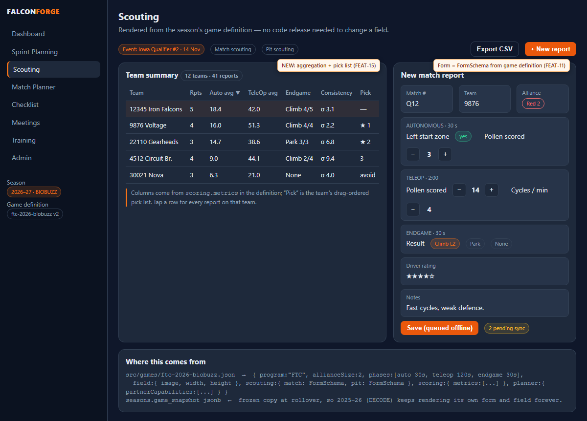
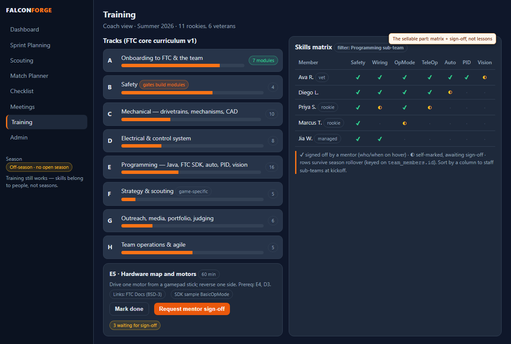
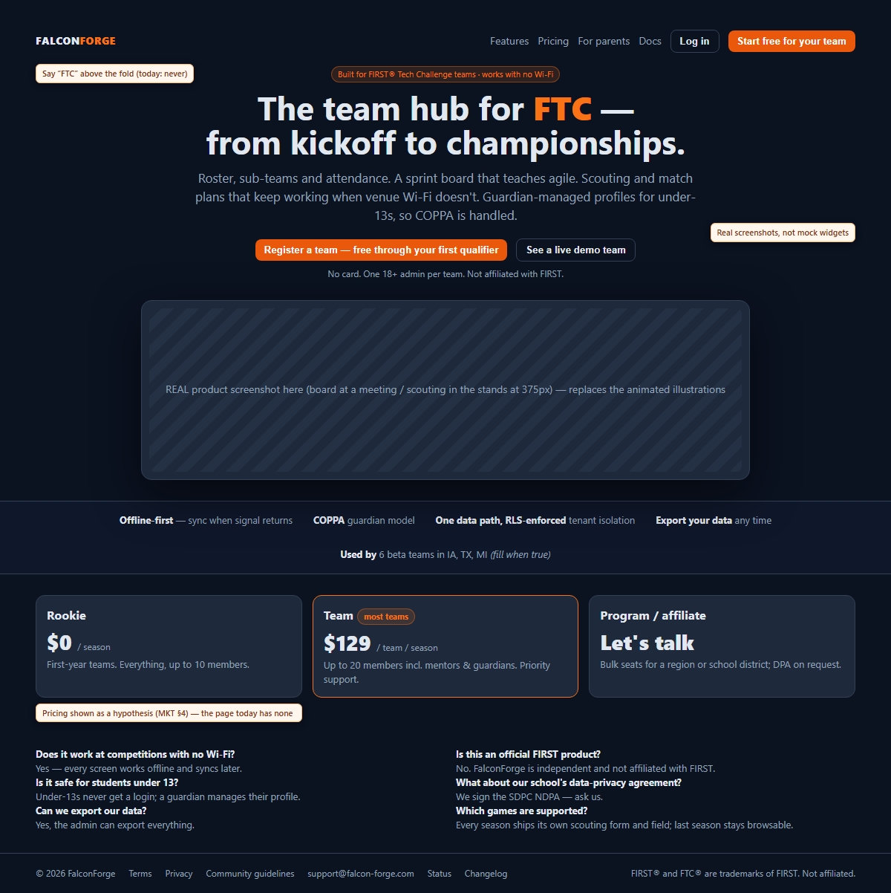

# FalconForge — comprehensive assessment, 22 August 2026

**Prepared by:** Claude Fable 5 (orchestrator) with eight specialised agents · **Against:** `main` @ `c1cec81` ·
**Audience:** Kevin, and the Opus-level agents that will implement whatever he picks from it.

This document is the synthesis. The full per-area reports — with every repro command, query
output and screenshot path — are in [`docs/assessment-2026-08/`](assessment-2026-08/) and are
the evidence for every ID cited here. **Nothing in this document is inferred without evidence;
where something was only code-traced and not executed, it says so.**

---

## 0. How to use this document

- Every finding has a stable ID (`SEC-01`, `SYNC-02`, `FEAT-11`, `OPS-06`, `WALK-A-03`,
  `LAND-04`, …) and every proposal has a `P-nn`. Tell an implementing agent "implement
  SEC-01 and SEC-02" and point it at the matching report under `docs/assessment-2026-08/`,
  which carries the file:line evidence, the repro and the fix direction.
- **Severity** — *Blocker*: a real team cannot use the product safely at a competition or at
  scale. *High*: beta teams will hit it this season. *Medium*: will be hit eventually. *Low*: polish.
- **Status vs plan** — whether `FALCONFORGE_V2_PLAN.md` §8 already knew. Several entries there
  turned out to be **wrong** (marked "KNOWN-but-worse" in the reports); §9 lists the plan lines
  that need correcting so the parking lot stays trustworthy.
- §6 (strategy and feature proposals) is where the "go-to platform" brainstorm lives; §7 is the
  landing page; §8 is a prioritised roadmap; §9 is the list of decisions only Kevin can make.
- **To run a sprint from this:** `HANDOFF_ASSESSMENT.md` (repo root) has the prompt, the sprint
  packages and the guardrails; [`decisions.md`](assessment-2026-08/decisions.md) is where Kevin
  records D1–D9; [`exit-criteria.md`](assessment-2026-08/exit-criteria.md) defines done per ID.

### Method, in one paragraph

The Gate was run first (green: lint / 670 unit + 2 skipped / 91 integration / build; precache
45 entries, 5.13 MiB). Eight agents then worked in parallel against the **local** Supabase
stack and the seeded review teams: (1) sync/offline/PWA/scale, (2) security, RLS, licensing,
COPPA, (3) feature completeness and game coupling, (4) live browser walkthrough of the core
roles, (5) live walkthrough of signup/licensing/guardian/operator edges, (6) market and
competitor research (web, cited), (7) training/onboarding research and design, (8) CI/deploy/
ops/test-truth. Security claims were reproduced over PostgREST as the real role; scale claims
were measured (1,200 seeded rows, wire sizes, EXPLAIN); walkthroughs used headless Playwright
at 1280×800 and 375×812. The orchestrator independently re-verified the four most serious
findings (SEC-01, SEC-02, SYNC-01, SYNC-02) against source and the live database before
including them. Production was not touched.

---

## 1. Executive summary

FalconForge is further along than most solo projects ever get: a genuinely hardened sync
engine, real RLS with 319 behavioural tests, a season model that works, a guardian/COPPA model
that is unusual and defensible, a green CI, and a landing page that looks like a product. The
foundation is worth building on. But the assessment found that **the product is not yet safe
to put in front of more than a handful of trusted teams**, for reasons that are specific,
reproducible and mostly cheap to fix:

1. **A coach can make themselves team admin — or strand the team — in three REST calls**
   (`SEC-01`, Blocker, reproduced). The roster UPDATE policy has no column restriction; the
   role-eligibility trigger only checks the *new* holder. Nothing in the RLS suite tries it.
2. **Data silently disappears from devices past 1,000 rows per table** (`SYNC-01`/`SEC-04`,
   High, measured: 1,200 tasks → 1,000 shown, overflow *deleted* locally, delta cursor advanced
   past them). `meeting_attendance` crosses 1,000 inside one season for a normal team.
3. **An expired session with a failed refresh pulls as `anon`, gets `200 []`, and wipes the
   device's offline copy** (`SYNC-02`, High, every link verified). Same class as B20.
4. **Two things the plan records as fixed are not.** "I've turned 18" reverts on the next
   sign-in because `handle_new_user` runs on every `auth.users` UPDATE (`SEC-02`); and the plan
   and runbook both say "the app never deletes a member" — it does, it fails for anyone with a
   task, and destroys attendance when it works (`SEC-03`).
5. **Every teammate can read every managed child's `notes` ("allergies, pickup arrangements")
   and `promotion_code`** over the API (`SEC-05`). The privacy policy promises otherwise.
6. **Sign-out silently destroys queued and parked offline work** (`SYNC-05`) — the shared
   team-laptop case.
7. **Scale cliffs are closer than the plan assumes.** Egress, not database size, is the first
   free-tier wall: ~0.7 MB per app open per device, ~10–20 active teams exhaust it (`SYNC-03`).
   Resend Free caps onboarding at ~4 teams/day and fails with a raw GoTrue string (`OPS-06`).
   The 90-day trial expires ~5 December for kickoff registrations with nothing but a banner
   (`SEC-07`). GitHub Pages' terms exclude commercial SaaS (`OPS-07`).
8. **The feature set records but cannot answer.** Scouting has no per-team aggregation, events,
   pit form or export (`FEAT-15`) — the reason a scouting lead keeps the Google Sheet. The
   planner is a kanban, not an agile teacher (no sprint entity, points, burndown, retro, DnD).
   The landing page sells analytics, pick lists and progression charts that do not exist
   (`FEAT-08`). Every teammate's task comment renders as "Guest" (`FEAT-01`).
9. **Game coupling is shallow and fixable.** DECODE is hard-coded in client literals only; the
   schema (`scouting_reports.data` jsonb, per-season field image, `game_title`) is already
   agnostic. A `GameDefinition` document + snapshot-on-season gives every season its own form
   and field with no migration for phase 1 (`FEAT-11`, §6.1).
10. **Observability is zero and the guardrails are quieter than they look.** A beta bug report
    arrives as prose plus build id `0.1.0` forever (`OPS-03`, `OPS-05`); Supabase logs last one
    day; backups are a manual habit on one laptop (`SYNC-11`/`OPS-09`). The coverage "ratchet"
    is red on all four metrics and nothing runs it (`OPS-01`); seven unit tests assert nothing
    (`OPS-02`).

**Market reality (cited in [MKT](assessment-2026-08/market-and-competition.md)):** ~8,900 FTC
teams played in 2025 (+10%/yr), ~70% US, roughly half first-year; the payable tier is ~2,500–
3,500 teams spending $10–20k/season. There is **no maintained FTC team-operations competitor**
(the one entrant, TeamForge, is free/self-hosted/AI-built and stale since Dec 2025). The
best-documented pain is offline scouting at venues — exactly FalconForge's architecture. Two
legal facts change the roadmap: the **official FTC Events API forbids commercial use**, and
**gm0 is CC BY-NC** (training content must be original or link-out). The pricing evidence
points at flat per-team-per-season rather than per-named-user — a contradiction with the
locked plan that needs a decision, not drift.

**If only five things get done before kickoff:** `SEC-01`, `SYNC-01`+`SYNC-03` (one change:
page + season-scope the pull), `SYNC-02`, `SEC-02`, and the landing-page overclaim (`FEAT-08`).
§8 has the full ordering.

---

## 2. Bugs — consolidated, most severe first

Full evidence per ID is in the area report named in the last column.

| ID | Sev | Finding | Status vs plan | Effort | Report |
|---|---|---|---|---|---|
| SEC-01 | **Blocker** | Coach → admin (or delete admin row) via plain REST; `team_members_update_roster` unrestricted, `enforce_member_role_eligibility` checks only the new holder, anyone can insert their own `terms` attestation | NEW | M | [SEC](assessment-2026-08/auth-rls-licensing.md) |
| SYNC-01 / SEC-04 | High | No pagination vs PostgREST `max_rows=1000`; full pull replaces collection → overflow deleted from device; delta cursor skips them for ever. Measured. | NEW | M | SYNC, SEC |
| SYNC-02 | High | `supabaseSync.accessToken()` falls back to the anon key; `anon` has SELECT; `200 []` is treated as "everything deleted" → local wipe | NEW | S | SYNC |
| SEC-02 | High | `on_auth_user_created` is `AFTER INSERT OR UPDATE`; `handle_new_user` COALESCEs signup metadata over `age_classification` on every login. Plan §8 says resolved. | KNOWN-but-worse | S | SEC |
| SEC-03 | High | `MemberManager` hard-DELETEs members; fails `23502` for anyone with a task; cascades attendance away when it succeeds. Plan + runbook say it sets `status='removed'` — false. | KNOWN-but-worse | M | SEC |
| SEC-05 | High | `managed_profiles_select_teammates` exposes `notes` and `promotion_code` to every rostered student | NEW | M | SEC |
| SYNC-05 | High | Sidebar sign-out clears queue + dead letters with no confirm | NEW | S | SYNC |
| FEAT-01 | High | Task comments by teammates render as "Guest" — writer stores auth user id, reader matches member id; test fixture hides it | NEW | S | [FEAT](assessment-2026-08/features-and-game-coupling.md) |
| WALK-B-01 | High | Guardians cannot reach Edit Profile / Getting Started — `AppShell.tsx:184` bounces every `/app/*` but `/app/guardian` to the team picker | NEW | S | [WALK-B](assessment-2026-08/walkthrough-licensing-guardian-onboarding.md) |
| WALK-A-06 | High | Scouting form DECODE-hard-coded, no filter/sort/search, no input validation (negative match #, 20-digit team #, unbounded notes) | KNOWN-in-spirit | M | [WALK-A](assessment-2026-08/walkthrough-core-roles.md) |
| WALK-A-07 | Medium | Re-attestation "Later" returns on every page load (observed 60+ times) | KNOWN-but-worse | S | WALK-A |
| WALK-B-02 | Medium | Guardian with rostered children lands on "Welcome! Let's get you set up" every sign-in; `GuardianOnly` exists only as a comment | NEW | S | WALK-B |
| WALK-B-03 | Medium | After promotion the guardian view shows the child "Not on a team yet" and re-offers hand-over; nothing records the promotion | NEW | M | WALK-B |
| WALK-B-04 | Medium | `/#/join/CODE` deep link lost across sign-up + confirmation | NEW | S | WALK-B |
| WALK-B-05 | Medium | Pending student never learns they were approved; `/#/join/CODE` shows a blank form afterwards | NEW | S–M | WALK-B |
| WALK-B-12 | Medium (prov.) | Board offers "New Item" to a lapsed team; `canEdit` ignores entitlement | KNOWN (client half) | S | WALK-B |
| SEC-09 | Medium | Invite code shown at team creation expires in **24 h** (InviteManager's are 7 days); no expiry shown — first thing every beta coach hits | NEW | S | SEC |
| SEC-06 | Medium | SECURITY DEFINER predicates exposed at `/rpc` to `anon`: `get_user_team_ids(<any uid>)`, `team_can_write(<any team>)` — cross-tenant oracles | KNOWN-but-worse | S–M | SEC |
| SEC-10 | Medium | Under-13 block is client-only; server accepts `age_classification='under_13'` | NEW | S | SEC |
| SYNC-06 | Medium | Whole-row last-write-wins: an offline edit reverts a teammate's other field | NEW | M | SYNC |
| SYNC-07 | Medium | "Synced" shown whenever `navigator.onLine` is true, even with every request failing (screenshot) | NEW | S | SYNC |
| FEAT-02 | Medium | Archived season: task modal Save/Delete/Archive, comment send, Restore are enabled; store refuses with `console.warn`, modal closes as if saved | NEW | S | FEAT |
| FEAT-05 | Medium | Match Planner Load → Save duplicates; `updateMatchPlan` has no caller; match number unsettable | NEW | S | FEAT |
| FEAT-12 | Medium | Due dates render one day early at US offsets | KNOWN | S | FEAT |
| OPS-04 | High | No schema/bundle handshake; a mismatched deploy retries `PGRST204`/`23502` into dead-letter with a wrong reason; stale PWA tabs run old bundle against new schema | partly KNOWN | M | [OPS](assessment-2026-08/engineering-health-ops.md) |
| OPS-03 | Medium | Build id is the constant `0.1.0` across all 18 deploys | NEW | S | OPS |
| SYNC-15 | Low | Pending record of team A briefly visible on team B's board after a switch | NEW | S | SYNC |
| FEAT-03/04/09/10/14 | Low | New-task comments dropped; checklist edits mutate store objects; two "progress" formulas; `deleteSeason` omits meetings; sub-teams cannot be renamed | NEW | S each | FEAT |
| SEC-13/15/16/17 | Low | Signup copy with confirmations on; guardian add-child/join race; guardian deletion cascade; client-side `Math.random` invite codes | NEW | S each | SEC |

*Low-severity walkthrough findings (WALK-A-08…12, WALK-B-06…11/13) are listed in §4.2/§4.3.*

---

## 3. Scale blockers — the cliffs, with numbers

| ID | Cliff | When it hits | Fix | Effort |
|---|---|---|---|---|
| SYNC-01 | 1,000 rows per table per team → silent truncation + local deletion | `meeting_attendance`: ~90 meetings × 15 members = inside season 1. `tasks`: season 2–3 (all seasons are pulled forever). | Page every pull; season-scope season-scoped tables; lazy-load archived seasons. | M |
| SYNC-03 | Supabase Free egress (5 GB/mo per Supabase's page; verify in dashboard) | ~0.7 MB per app open per device (measured); 15 devices × 6 opens/day ≈ 1–2 GB/team/month uncompressed → **~10–20 active teams**. A 500 KB base64 field image rides along with every `seasons` pull. | Same change as SYNC-01 plus delta-on-mount, drop the 30 s focus refetch when realtime is connected, move field images to Storage. | M |
| SYNC-04 | 200 concurrent realtime connections | One socket per tab, 24 bindings; **~15–25 teams meeting the same evening**. Degrades to the expensive pull path. | Subscribe per route; tear down on hidden tab; Pro tier later. | S / L |
| OPS-06 | Resend Free 100 emails/day | 20-member team ≈ 23 emails → **~4 teams/day**; failure surfaces as a raw GoTrue string | Resend Pro ($20/mo) or staggered onboarding; friendly copy. | S |
| SEC-07 | 90-day trial from `create_team_as_admin` | Kickoff registration → read-only **~5 Dec 2026**, mid-qualifiers; only an in-app banner; content screens keep offering writes that dead-letter | Operator expiry view + reminder; gift at onboarding or lengthen trial; gate editors on `isReadOnly`. | M |
| OPS-09 | Supabase Free pauses after 7 idle days; no backups | Off-season; first kickoff login fails opaquely | Weekly `ops.yml`: keep-alive GET + encrypted `db dump`. Pro ($25/mo) when real team data exists. | S |
| OPS-07 | GitHub Pages ToS excludes commercial SaaS and password handling | The day Stripe goes live | Add "first paid licence" as a hard Cloudflare trigger (plan is otherwise sound). | S (doc) |
| SYNC-10 / OPS-05 | No server-side signal of a stuck device; logs kept 1 day | First competition weekend | `client_events` table (INSERT-only, RLS), dead-letter + heartbeat rows, operator view; uptime check. | M |
| SEC-11 | No deletion/erasure/export/invoice tooling | First real erasure request or churned customer | Operator RPCs + guardian "remove child" + team export (Sprint 11). | L |
| SEC-08 | Unlimited trial chaining; any user can INSERT bare `teams` rows | When billing exists | Drop `teams_insert_owner`; flag >1 trial per creator. | S |

RLS itself is **not** a scale problem: ~18 µs/row for the per-row `is_team_member` call
(21k tasks → 394 ms). Database size is not either (~0.5–1 MB per team-season).

---

## 4. Unfinished sections and what the live walkthrough found

### 4.1 Feature inventory (static audit, [FEAT §1](assessment-2026-08/features-and-game-coupling.md))

| Screen | State | The gap that matters |
|---|---|---|
| Sprint board / list / "calendar" | partial / partial / **stub** | No DnD (help page says "Drag a card"); list shows Archived rows; "Calendar" is a sorted list. No sprint entity, points, burndown, retro, WIP, priority, swimlanes. |
| Task modal | partial | `tags` dead field; only Feature/Bug; comments "Guest" (FEAT-01); archived-season controls live (FEAT-02). |
| Scouting | **partial** | Card list only. No per-team aggregation, sort/filter, event entity, pit scouting, alliance colour, export. DECODE-shaped form. |
| Match Planner | partial | Freehand only; no tokens/labels; Load→Save duplicates; dead d3 drag code; square 600×600 assumption; "Lifted Park" persisted as a column. |
| Pre-match checklist | complete | One shared tick state per season; "Reset" destroys who-ticked-what. |
| Meetings / attendance / check-in | complete (Sprint 8) | Competition events are a meeting type with no link to scouting/plans. |
| Seasons | complete | Rollover clones sub-team *names* only (correct per principle 5); game not structurally bound. |
| Admin / members / invites | complete | Sub-teams cannot be renamed; member "remove" is a broken DELETE (SEC-03); 24 h creation code (SEC-09). |
| Guardian view, operator console | complete | Operator lacks deletion/erasure/export/expiry (SEC-11, SEC-07). |
| Engineering notebook / judging / awards | **absent** | Hooks exist (`tasks.timeline`, `meetings`), nothing reads them. |
| Training / onboarding | **absent** | §6.4. |

### 4.2 Live walkthrough — core roles (WALK-A)

*Full report: [walkthrough-core-roles.md](assessment-2026-08/walkthrough-core-roles.md). Headless
Playwright, every route at 1280×800 and 375×812 with hard reload, console/network capture, geometry
scan, axe-core. Stopped before the offline, roster and recurring-meeting scenarios (listed below).*

**Confirmed from the static audit (browser + DB):** FEAT-01 "Guest" comment author
(`shots/walkA-d-admin-sees-student-comment.png`), FEAT-02 archived-season modal silently discards
(`shots/walkA-d-board-archived-season-modal.png`), FEAT-05 Load→Save duplicates match plans, FEAT-12
due date one day early (`2026-09-15` entered → card shows `9/14/2026`).

| ID | Sev | Finding |
|---|---|---|
| WALK-A-06 | High | Scouting form is DECODE-hard-coded with no event filter, no sort/search, no validation (team # accepted `-12345678901234567890 🦅`, match # `-5`, 5,000-char notes unbounded). |
| WALK-A-07 | Medium | Re-attestation "Later" does not persist — the prompt returned on **every** page load (60+ times in the run). Worse than plan §8 describes; blocks a QR check-in. |
| WALK-A-05 | Medium | Board: no DnD (`draggable=null`), no sprints, no filters/search; 5th column off-screen at 1280 px. |
| WALK-A-08 | Low | Task modal: focus not moved into the dialog, Escape does not close (existing-task path). |
| WALK-A-09 | Low | axe: 14 unlabeled role `<select>`s on Admin, unlabeled "show past" toggle, secondary-text contrast 2.5–3.1:1 on every page. |
| WALK-A-10 | Low | 375 px tap targets under 32 px: Approve/Reject 40×28, COPPA checkbox 13×13, meeting filter pills 26 px, dashboard text links 14 px high. No horizontal overflow on any route. |
| WALK-A-11 | Low | Long meeting titles clip; long scouting team numbers overflow the card; no `maxLength` on any title field. |
| WALK-A-12 | Low | `FalconForgeDB` still listed after sign-out — verify whether stores are emptied (shared pit laptop). |

**Verified working:** every route survives hard reload; back button; double-submit protection
(exactly one task / one plan); scouting and checklist round-trips; planner drawing persists;
meeting create → QR code matches `meetings.public_code`; poster/roster pages; licence panel at
15/15; season rollover (structure cloned, `member_ids = {}`); zero 4xx/5xx on any route;
page loads 630–900 ms, login ~1 s.

**Not yet covered:** offline scenarios (`walkA/07-offline.mjs` written, not run — the e2e pack and
the SYNC agent's cold-boot check cover part of this); full student/mentor route sweeps; roster
approve/role-change/remove; recurring series and attendance override; switching back to the
archived season; "I've turned 18" on a 13–17 account; admin nomination end to end; modal geometry
at 375 px; brand-new-team empty state.

> Local DB side-effect: WALK-A rolled Iron Falcons to a new "2027-2028 Season" (previous season now archived). Run `npm run seed:review` after a `db reset` before re-testing.

### 4.3 Live walkthrough — signup funnel, licensing states, guardian, operator (WALK-B)

*Full report: [walkthrough-licensing-guardian-onboarding.md](assessment-2026-08/walkthrough-licensing-guardian-onboarding.md),
including a step-by-step first-run funnel narrative with screenshots at 375 px. Stopped before the
operator console, multi-team switching, legal pages and most auth edges.*

| ID | Sev | Finding |
|---|---|---|
| WALK-B-01 | High | **Guardians cannot reach Edit Profile or Getting Started** — `AppShell.tsx:184` exempts only `/app/guardian` from the no-team redirect; every other `/app/*` route bounces to the team picker a second later, including links the guardian's own sidebar offers. |
| WALK-B-02 | Medium | A guardian with rostered children lands on "Welcome! Let's get you set up" on **every** sign-in; the `GuardianOnly` routing the code comment promises does not exist (`shots/walkB-guardianS1-landing-d.png`). |
| WALK-B-03 | Medium | After a successful promotion (verified in DB), the guardian view shows the child as "Not on a team yet" and offers "Give them their own login" again — `claim_managed_profile` only nulls the code; nothing records the promotion (`shots/walkB-guardian17-after-promotion-d.png`). |
| WALK-B-04 | Medium | Invite deep link `/#/join/CODE` is lost across sign-up + confirmation; the student re-types the code (failure-modes §14). |
| WALK-B-05 | Medium | A pending student is never told they were approved; after approval `/#/join/CODE` shows a blank form (`shots/walkB-student12-after-approval-reload-m.png`). |
| WALK-B-12 | Medium (provisional) | Board offers "New Item" to a lapsed team (`canEdit` ignores entitlement); the write outcome was not verified — rerun needed. Lapsed "Generate Link" tooltip gives the wrong reason. |
| WALK-B-08 / SEC-09 | Low | Creation-time invite code "23h 59m remaining" beside a 7-day one under "Invite links last a week" (`shots/walkB-funnel12-invite-generated-m.png`). |
| WALK-B-06/07/09/10/11/13 | Low | "Welcome back" on a brand-new coach's first screen; two different wrong truncations of the team number (`#99` vs `#911` for 9911); trial labelled "Gifted licence"; 142-char emoji child name accepted; 13–17 member listed in the nominate dropdown; stranded admin sees a blank Welcome with no mention of their team. |

**Verified working:** the self-serve coach funnel end to end with email confirmation (~4 screens,
no dead ends); licensing banners and refusals render exactly as designed for full / lapsed /
expiring (`shots/walkB-lic-lapsed-dashboard-m.png`); promotion claim is single-use, case-insensitive,
preserves membership id / seat / attendance; password-recovery and confirmation tokens are detected on
a real document load; zero 4xx/5xx and zero runtime errors across ~20 contexts.

**Not yet covered:** operator console flows (`full@` was inserted into `platform_operators` locally
and shows the rail item); multi-team switching; legal pages; wrong-password / existing-email /
deep-link-return auth edges; "I've turned 18" click; adversarial team names; under-13 signup path;
the queued-before-lapse probe (inconclusive — wrong selector).

---

## 5. Engineering health and test truth (OPS)

The pipeline is healthy (22/24 CI green, both failures pre-date their fixes; Gate ≈ 60 s local;
generated DB types have zero drift; 17 migrations on disk = 17 applied). What is not:

- **OPS-01** — coverage thresholds fail on all four metrics (64.7 / 56.4 / 59.1 / 62.9 vs
  74 / 67 / 69 / 72) and nothing runs `test:coverage`. Sprints 6–9 shipped meetings (21%),
  guardian (7%), admin (48%) UIs; `ResetPassword.tsx`, `GuardianView.tsx`, `GettingStarted.tsx`
  and nine meetings components are at **0%**. Either wire it into CI and re-baseline honestly, or
  delete the numbers. Do not keep a number that is neither enforced nor true.
- **OPS-02** — 7 unit tests have no assertion; ~25 put the assertion behind `if (button)`. All in
  the four competition-day screens (board, scouting, checklist, planner). Add a "no test
  without an assertion" ratchet to `harness-invariants.test.ts`.
- **OPS-10** — `deploy.yml` re-implements the Gate without ESLint, RLS or smoke, and goes live a
  minute before CI finishes. Make it call `npm run gate` and gate on CI.
- **OPS-11 / OPS-15** — README is wrong about demo mode, OAuth, Node 18 (toolchain needs ≥20.19),
  `db push`, spec and arbitrary-value counts; `.env.development.local`, Docker and the CLI pin
  are undocumented for a second machine. `LICENSE` is missing while README says MIT — probably
  not intended for a SaaS.
- **OPS-12** — 2 production advisories (`ws` via supabase-js, react-router open-redirect), both
  fixed by in-range updates. Vite 5 / vite-plugin-pwa 0.17 are the majors to schedule post-beta.
- **OPS-13** — e2e pack (21 tests) never visits the board, planner, reset-password, guardian,
  licence-lapse, admin transfer or operator flows, and has no mobile project.
- **OPS-14** — `docs/beta-ops.md` lacks runbooks for migration failure, dead-letter triage,
  licence operations, admin-left, and "the project is paused".
- **OPS-08 / SYNC-12** — precache 5.13 MiB, 3.2 MB of it one 1024² PNG four times (KNOWN,
  unchanged); `includeAssets` double-lists three files.
- **CLAUDE.md says "592-test suite"**; it is 1,239 + 2 skipped across the three suites.

Ticket-ready list: [OPS Appendix D](assessment-2026-08/engineering-health-ops.md#appendix-d--ops-gap-list-ticket-ready).

---

## 6. Product strategy and feature proposals — "the go-to platform"

Grounding (all cited in [MKT](assessment-2026-08/market-and-competition.md)): the market is
~9,000 active FTC teams; the competitive gap is team *operations* (FRC scouting is a red ocean,
FTC team-ops is empty); the documented pains are venue Wi-Fi, adults needing an auditable
district-allowed system of record (students keep Discord regardless), parent visibility,
coordinating collaboration (#1 concern of Worlds teams in the ASEE survey), attendance/hours,
graduation knowledge loss, and portfolio/judging prep. School teams (75–80% at regional level)
need a signed SDPC NDPA before rostering minors; parent-run teams (half of Worlds) do not —
**beta with community teams**.

### P-01 — Game-agnostic model: `GameDefinition` + snapshot on season (answers the DECODE question)

*From [FEAT §2](assessment-2026-08/features-and-game-coupling.md#2-game--season-coupling--where-decode-2025-26-is-hard-coded).*
Rendering: [`mockups/scouting-game-definition.png`](assessment-2026-08/mockups/scouting-game-definition.png).

- **Where the coupling is:** `FIELD_IMAGE_URL` (`constants.ts:33`), the `ScoutingReport` field
  unions (`types.ts:153-172`), the form (`ScoutingReports.tsx:346-444`), the hand-enumerated
  jsonb mapping (`entity-registry.ts:248-297`), "Autonomous"/"Lifted Park" partner checkboxes
  persisted as real columns (`MatchPlanner.tsx:346-349`), a square 600×600 viewBox, free-text
  `game_title`. **Not** in the schema — `scouting_reports.data` is already jsonb, the field
  image is already per-season, `game_title` already exists.
- **The model:** a declarative, versioned `GameDefinition` per `(program, season)`: alliance size,
  phases with durations, field image + dimensions (+ optional zones), `scouting.match` and
  `scouting.pit` as a `FormSchema`, `scoring.metrics` (derived numbers), `planner.partnerCapabilities`.
  Today's scouting rows are already valid instances of a DECODE FormSchema — no data rewrite.
- **Where it lives (offline is the constraint):** phase 1 = bundled JSON (`src/games/ftc-2025-decode.json`,
  `ftc-2026-biobuzz.json`) — offline by construction, no migration. Phase 2 = global
  `game_definitions` table pulled with `scope:'global'` + `team_game_overrides (patch jsonb)`;
  recommend **curated templates + light overrides** (add/hide/relabel a field), not a full form
  builder. Always: `seasons.game_snapshot jsonb` frozen at rollover so an archived season
  renders its own game forever.
- **FRC without building it:** `program:'FRC'`, `allianceSize:3`, rectangular field, different
  phase durations, `eventsSource:'tba'`. Districts/TBA are event-layer concerns (P-02).
- **Phasing:** S — bundled JSON + a `SchemaForm` component + planner reads image/size/capabilities
  + season "Game" select. M — snapshot column, registry, overrides UI, metrics-driven summary
  table. L — events import, pit scouting, pick list, FRC file.

### P-02 — Scouting that answers questions (the reason to leave the Sheet)

Minimal competitive set for beta (FEAT §3): (1) per-team summary table with schema-driven
metrics, sortable; (2) team detail with all reports; (3) match # + alliance colour/station on
the form; (4) CSV export. Next: `competition_events` entity (links meetings' `competition`
type, scouting, plans), pit scouting (`scouting_reports.kind`), drag-ordered pick list.
**Event data:** do not consume the FTC Events API in a paid product (its terms forbid
commercial use — MKT §2). Options: user-side import (the coach pastes a schedule fetched with
their own key), FTCScout with written permission, or make the schedule view a free unlicensed
feature. Needs a legal read before building. **Scout-to-scout sharing without a server**
(QR burst / WebRTC / local relay) is the one thing every venue thread asks for and nobody in
FTC has; it is also the only feature with event-day virality (Maneuver's 1,500 FRC users).

### P-03 — Make the planner actually teach agile

In value order (FEAT §4): sprint entity (`sprints`: goal, dates, retro notes; `tasks.sprint_id`)
with a backlog drawer; guided first-sprint wizard on an empty board (mostly copy); sprint
review/retro screen (doubles as notebook material); points + burndown from the existing
`tasks.timeline`; WIP limit + Definition-of-Done template on the per-task checklist; DnD.

### P-04 — The irreplaceable artefact: per-person history across seasons

Hudl is sticky because the video *is* the record. FalconForge's candidates (MKT "so what" #8):
attendance/hours per member across seasons (portfolio "team management" section, outreach
awards, parent visibility), the season archive, the scouting DB across events. Promote
per-member season summaries and exportable hours reports to first-class features; they use
data already held.

### P-05 — Parent visibility for all minors, not only under-13s

The evidence (TeamSnap's appeal, the accountability thread) says a read-only guardian view for
*every* minor — attendance, upcoming meetings, what their student is assigned — is the feature
a parent-run team's admin pays for. The guardian model already exists; this extends its scope.
Needs the SEC-05 column exposure fixed first.

### P-06 — Training & onboarding section (the off-season pillar)

*From [TRAIN](assessment-2026-08/training-onboarding-design.md).* Rendering:
[`mockups/training-skills-matrix.png`](assessment-2026-08/mockups/training-skills-matrix.png).

- **What the evidence says teams do:** a real robot in the first hour, a weekly lesson +
  project cadence, a written checklist, and a **team-lead sign-off that gates competition
  attendance**. Nobody found uses badges, quizzes or an LMS; Thinkscape is unmentioned.
- **The sellable part is not lessons.** It is the **skills matrix + mentor sign-off + off-season
  mode** on the roster and sub-teams the team already pays for; it fills June–August in a
  season-centric product and is a "why the whole team needs seats" feature. Price it into the
  seat.
- **Licensing (verified):** FTC Docs and SDK samples are BSD-3 — the only text a paid product
  may copy. gm0 is **CC BY-NC** — link only. CTRL ALT FTC and *Learn Java for FTC* have no open
  licence — link only. None of the major sources is BY-SA. Add a build-time guard (TRAIN-03).
- **Curriculum:** 8 tracks / 65 modules / ~60 learner-hours in TRAIN §2.1 — Onboarding, Safety,
  Mechanical, Electrical/control, Programming (16 modules: Java → OpMode lifecycle → hardware
  map → TeleOp → sensors → encoders → auto → PID → odometry/Pedro/Road Runner → AprilTag/
  Limelight → Dashboard → git/structure → Kotlin), Strategy & scouting, Outreach/portfolio/
  judging, Team ops & agile. Each with objective, prereq, hands-on task, checkpoint, minutes,
  link-vs-author, game-agnostic vs game-specific.
- **Product model:** `member_progress` and `skill_signoff` keyed on `team_members.id` (team-scoped,
  **not** season-scoped — `team_members` already survives rollover); core content as markdown in
  the repo compiled into precached chunks (+~2 MB budget, no hosted video); team modules as
  registry entities; Training route independent of `currentSeasonId` (TRAIN-01: there is no
  existing pattern for team-scoped, season-free, client-writable data — the first implementer
  must not copy a `season_is_open()` policy).
- **Cost, honestly:** Phase 1 (schema + UI + link-out skeleton + checkpoints + 5-q quizzes) ≈ one
  sprint of app work + 110–150 h of authoring; original lessons for the electrical and
  programming tracks another 200–300 h. Phase 1 FTC SDK facts are current (v11.2.1; BIOBUZZ
  kicks off 12 Sept 2026 with a new SDK, so Track E needs a yearly pass).

### P-07 — Engineering notebook / portfolio bridge

Nothing exists (AI helpers were removed). Cheap high-value bridge: export tasks + timeline +
meetings + attendance + outreach hours for a date range as a one-page "team management"
summary for the 15-page portfolio — unique in the market, uses held data. A dated-entry
notebook with images needs Supabase Storage and an offline upload queue (new backend surface;
post-beta). A judging-rubric checklist template (Think/Connect/Innovate/Control) can ride on
the game definition.

### P-08 — Pricing and packaging (decision needed)

Every FTC tool is free; per-named-user × 13 users ≈ $470/yr exceeds Hudl's entry tier and is
~10% of a regional team's budget. The evidence fits **flat per-team-per-season (~$99–149) with
a free rookie tier and an affiliate/PDP bulk rate**; per-seat punishes guardians and drop-in
mentors and breaks at FRC roster sizes. This contradicts plan §2. Decide explicitly (§9).

### P-09 — Integrate with, don't duplicate, FIRST's Dashboard

FIRST owns registration, YPP screening and the per-season Consent & Release. FalconForge's
roster is the *operational* roster; import/link, never pretend to be the legal one.

### P-10 — Go-to-market

Unofficial FTC Discord + Chief Delphi launch **with a live hosted demo team** (the thing
TeamForge could not offer) → PR to gm0's resources page → one or two Program Delivery Partners
(Texas, Michigan have the most events) for rookie-cohort gifting → a second "scouting-only"
push for November qualifiers → FRC only after the FTC season proves retention. Before selling
to schools: sign the SDPC NDPA v2.2 once, publish a subprocessor list, Supabase Pro, off
gh-pages (security headers).

### P-11 — Observability and operator tooling for scale

`client_events` (INSERT-only RLS, dead-letter + daily heartbeat rows, operator view);
build id from git SHA in every report; uptime check; scheduled encrypted backups; schema/bundle
version handshake; operator expiry list + erasure/delete/export RPCs. (SYNC-10/11, OPS-03/04/05/09, SEC-07/11.)

---

## 7. Landing page review

What is there: a polished dark hero ("Don't just build your robot… FORGE IT"), six feature
cards, five animated illustration sections, a roles section with "Register a Team", a footer.
No horizontal overflow at 375px; 6,266 px tall on desktop, 10,120 px on mobile.
Rendering of the proposed direction: [`mockups/landing-revised.png`](assessment-2026-08/mockups/landing-revised.png).

| ID | Finding | Why it matters | Fix |
|---|---|---|---|
| LAND-01 | **The page contains zero `<a>` elements** (measured). No Terms, Privacy, Community Guidelines, support address, or external links; the legal routes exist (`/#/legal/*`) but are unreachable from the page. | A product holding minors' data with no visible privacy policy link fails the first look from a district privacy officer or a careful parent; also hurts credibility and SEO. | Footer with Terms / Privacy / Guidelines / support@ / status; "Not affiliated with FIRST" line; trademark notice. |
| LAND-02 | The body copy never says **"FTC"** or **"FIRST Tech Challenge"** (only the `<meta description>` does). Pill says "robotics team". | The buyer searches "FTC team management"; the page reads as generic robotics. | Name the program above the fold; mention BIOBUZZ/season readiness. |
| LAND-03 | **Overclaims** (FEAT-08): "analyze scouting data", "Detailed match analysis", "Data-driven alliance selection", "powerful metrics for your picklist", "Team progression charts", "tag key starting positions", "assign tasks to alliance partners", mentor "Analyze aggregate scouting data". None exists. | The claim most likely to generate "where is…" support mail; damages trust at the first event. | Rewrite to what ships, or build P-02's summary table first. |
| LAND-04 | No pricing, no "free for beta/rookies", no mention of the 18+ admin, seats, or what happens after the trial. The roles section is styled as pricing tiers with no prices. | A coach cannot tell what they are signing up for; the 90-day trial (SEC-07) is invisible. | Pricing section once P-08 is decided; until then "Free during the 2026–27 beta". |
| LAND-05 | All visuals are animated CSS mock widgets; no real screenshot, no 375px phone shot of scouting in the stands. | Real screenshots convert better for a tool product and cannot overclaim. `npm run capture` already produces them. | Replace at least the hero and scouting illustrations with captures. |
| LAND-06 | No social proof, FAQ, or "how it works in 3 steps"; no parent-facing section despite the guardian model being a differentiator; no offline-first proof point near the top. | The three strongest differentiators (offline, COPPA/guardian, seasons) are buried in a six-card grid. | Trust strip under the hero (offline · COPPA · export · isolation); FAQ; "For parents" anchor. |
| LAND-07 | `og:image` is the 1024² logo; `<title>` is "FalconForge" with no descriptor; hero background is a 595 KB PNG; no `canonical`. | Link previews in Discord/Chief Delphi (the launch channels) show a bare logo. | Dedicated 1200×630 OG image with a screenshot; title "FalconForge — team hub for FTC"; WebP hero. |
| LAND-08 | "Built for the whole team" labels the Coach card "Team Admin" and describes it as "lead administrators and head teachers", while the app's roles are admin / coach / mentor / student — the page has no guardian role at all. | Mismatch with the product's own vocabulary. | Four roles + guardian; one sentence each, matching in-app terms. |
| LAND-09 | Mobile page is 10,120 px tall; the animated sections stack to a very long scroll before the roles/CTA. | Coaches will open the Discord link on a phone. | Sticky CTA or a shorter mobile variant; cut two illustration sections. |

---

## 8. Prioritised roadmap

Ordered so that each phase is shippable on its own. Effort: S < ½ day, M 1–2 days, L a sprint.

### Phase 0 — before any more beta teams are invited (≈1 sprint)
1. **SEC-01** admin-row/role protection trigger + RLS tests (M).
2. **SYNC-01 + SYNC-03** page every pull, season-scope season-scoped tables, lazy archived
   seasons, delta-on-mount, field image out of the `seasons` pull (M).
3. **SYNC-02** never pull as anon; assert `role=authenticated` before replacing a collection (S).
4. **SEC-02** `handle_new_user` stops rewriting `age_classification`/`full_name` on UPDATE (S).
5. **SEC-03** remove/reject → `status='removed'`; per-column `ON DELETE SET NULL` later (M).
6. **SEC-05** column-limited teammate view of `managed_profiles` (M).
7. **SYNC-05** sign-out confirm when queue/dead letters non-empty (S).
8. **SEC-09** 7-day creation code + expiry shown (S). **FEAT-01** comment author (S).
   **WALK-B-01/02** guardian shell routing (S). **WALK-A-07** persist re-attestation "Later" (S).
9. **OPS-06** Resend Pro or staggered onboarding; friendly error copy (S).
10. **LAND-01/02/03** footer links, say FTC, remove overclaims (S).
11. Correct the plan §8 lines listed in §9.2 (S).

### Phase 1 — during the early season (Sept–Oct)
- **P-01 phase S** bundled `GameDefinition` + `SchemaForm` + planner geometry (this is also
  the BIOBUZZ readiness work — the form must change for the new game anyway).
- **P-02 minimal set** summary table, team detail, match #/alliance, CSV export (M).
- **SEC-07** operator expiry view + reminder; gate editors on `isReadOnly` (M).
- **SYNC-07** honest sync status; **SYNC-08** `storage.persist()`; **FEAT-02/05** (S each).
- **WALK-B-03/04/05** promotion record, invite deep-link persistence, approval notification (S–M); **WALK-B-12** `canEdit` honours entitlement (S); **WALK-A-06** input validation + filters (M, overlaps P-02).
- **WALK-A-08/09/10/11** modal focus/Esc, a11y labels + contrast tokens, tap targets, title wrapping/limits (S each).
- **P-11 first half**: build id from SHA; feedback body with context; uptime check; scheduled
  encrypted backups; `deploy.yml` → `npm run gate` (S each).
- **OPS-01/02** coverage truth and assertion-free tests (S); **OPS-11** README truth pass (S).
- **SEC-06/08/10** predicate exposure, bare `teams` insert, server-side under-13 refusal (S each).

### Phase 2 — in-season (Nov–Feb)
- **SYNC-06** partial updates / conflict detection (M). **OPS-04** schema/bundle handshake (M).
- **P-03** sprint entity + wizard + retro (M–L). **P-04** per-member history + hours export (M).
- **P-01 phase M** snapshot column, global definitions, overrides (M). Events entity (M).
- **Sprint 10 Stripe** under whichever pricing P-08 decides. **Sprint 11 export**.
- **SEC-11** erasure/delete RPCs; **SYNC-10** `client_events`.

### Phase 3 — post-season (Apr–Aug 2027)
- **P-06 Training phase 1** (L + authoring). **P-05** parent view for all minors (M).
- **P-07** portfolio export (M). Scout-to-scout local sharing (L). Cloudflare move (planned).
- Vite/PWA-plugin/Dexie upgrades; e2e mobile project + board/planner/reset specs.
- FRC definition file and event-source abstraction (only if FTC retention holds).

---

## 9. Decisions only Kevin can make

### 9.1 Product / business
1. **Pricing model** — keep per-named-user (plan §2) or move to flat per-team-per-season with
   a free rookie tier (P-08). Affects Stripe sprint design, the landing page, and seat semantics.
2. **FTC Events API** — accept "no official event data in a paid product" and choose: user-side
   import, FTCScout permission, or a free unlicensed schedule view. Get a legal read.
3. **Trial** — replace the automatic 90-day trial for beta teams with a season-long gift at
   onboarding, or lengthen it; and whether under-18 nomination should be softened (plan §8).
4. **Scouting form customisation** — curated templates + light overrides (recommended) vs a
   full form builder.
5. **Training scope** — Phase 1 skeleton only, and who authors (Kevin vs veteran students).
6. **Beta cohort** — community/parent-run teams first (no DPA needed); whether to pursue a
   signed SDPC NDPA this season.
7. **Hosting triggers** — add "first paid licence" to the Cloudflare plan; Supabase Pro at
   "first real team data" rather than "first paying customer".
8. **Students editing any teammate's task/report/plan** — RLS and UI agree today
   (`can_manage_content` = any member); confirm it is a product decision.

### 9.2 Plan §8 corrections (the parking lot currently says things that are false)
- "✅ RESOLVED 2026-08-22 (`v2/age-classification-writer`)" — the server half is not fixed (SEC-02).
- "the app never deletes a member — `MemberManager` sets `status = 'removed'`" — it DELETEs (SEC-03); `docs/beta-ops.md:295-297` repeats it.
- "traffic will not come close to any limit" (§3 Hosting) — egress will, at ~10–20 teams (SYNC-03).
- "coverage thresholds are enforced by nothing" — now also failing by ~10 points (OPS-01).
- CLAUDE.md "592-test suite" → 1,239 + 2 skipped. README: six false claims (OPS-11).
- The `team_seats_remaining` allowlist rationale in `schema_assertions.sql` is wrong (SEC-17).

---

## 10. What was *not* checked

- Production / the hosted Supabase project (dashboard settings, Resend usage, pause state,
  actual egress). SEC-14 lists the eleven dashboard-only settings the code depends on.
- The two live walkthroughs were cut short by the session limit; their "Not yet covered" lists (§4.2, §4.3) are the remaining manual-verification backlog — notably offline queue/conflict scenarios in the browser, the operator console, multi-team switching, and the lapsed-team write outcome.
- `test:rls` / `test:db` / `db:verify` were not run by the agents (they truncate the review DB);
  the Gate was. iOS Safari storage eviction and real-device behaviour. Realtime under load.
- Reddit r/FTC and the FTC Discord were unreachable for research; forum evidence is Chief
  Delphi-heavy. FTCScout API terms are unpublished. Willingness-to-pay has no data — ask the
  beta coaches one question: "show me how you decided who went on the programming sub-team."
- DECODE rule details were not checked against the game manual; the claim is only that the
  form is a shooting-game form with no rubric.

---

## Appendix — report index

| Report | Area | Findings |
|---|---|---|
| [auth-rls-licensing.md](assessment-2026-08/auth-rls-licensing.md) | SEC | 16 + RLS policy table + role capability matrix |
| [sync-offline-scale.md](assessment-2026-08/sync-offline-scale.md) | SYNC | 16 + architecture-as-built |
| [features-and-game-coupling.md](assessment-2026-08/features-and-game-coupling.md) | FEAT | 15 + feature inventory + game-definition design |
| [walkthrough-core-roles.md](assessment-2026-08/walkthrough-core-roles.md) | WALK-A | live browser, admin/student/mentor |
| [walkthrough-licensing-guardian-onboarding.md](assessment-2026-08/walkthrough-licensing-guardian-onboarding.md) | WALK-B | live browser, funnel/licensing/guardian/operator |
| [market-and-competition.md](assessment-2026-08/market-and-competition.md) | MKT | 49 sources, competitor matrix |
| [training-onboarding-design.md](assessment-2026-08/training-onboarding-design.md) | TRAIN | 65-module curriculum + product model + 3 findings |
| [engineering-health-ops.md](assessment-2026-08/engineering-health-ops.md) | OPS | 17 + coverage/deps/limits tables + ticket list |
| [mockups/](assessment-2026-08/mockups/) | — | three HTML renderings + PNGs |
| [shots/](assessment-2026-08/shots/) | — | 12 key screenshots cited above (full set of ~220 is in the session scratchpad) |
| [decisions.md](assessment-2026-08/decisions.md) | — | D1–D9 decision record (Kevin fills in) |
| [exit-criteria.md](assessment-2026-08/exit-criteria.md) | — | per-ID definition of done, red test, trap — Phases 0–1 |
| [agent-brief.md](assessment-2026-08/agent-brief.md), [walkthrough-prompts.md](assessment-2026-08/walkthrough-prompts.md) | — | how the agents were briefed; re-run the walkthroughs from these |
