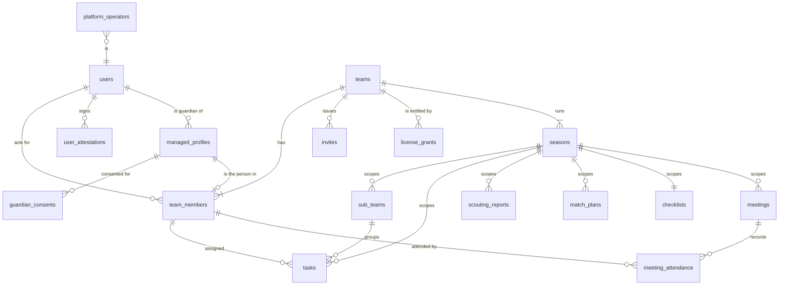

# FalconForge V2 — schema reference

**Frozen at the end of Sprint 3 (2026-08-15).** Everything from here is a forward migration:
no more squashing, no more editing a migration that has already been applied anywhere.

**Forward migrations since the freeze:**

| Migration | Sprint | What it added |
|---|---|---|
| `20260817000000_v2_season_lifecycle.sql` | 4 | `seasons.game_title`, `seasons.is_archived`, the `season_is_open` / `meeting_season_is_open` predicates, and the rewritten season-scoped write policies. Plus `REPLICA IDENTITY FULL` on `seasons` (B22). |

The authoritative definition is `supabase/migrations/20260816*` plus the forward migrations
above, and the invariants are
enforced by `supabase/tests/schema_assertions.sql` (structure) and `src/test/db/` (behaviour).
This document explains the shape and the reasoning; when it disagrees with the SQL, the SQL
is right and this file is stale.

---

## The model in one paragraph

A **team** is the tenant. Exactly one **admin** per team — 18+, attested, and the only role
that touches licensing — alongside coaches, mentors and students. A team's right to *write*
is an **entitlement** derived from `license_grants`; when it lapses the team becomes
read-only and never loses a row. A child under 13 has no login at all: a **guardian**'s
account holds a `managed_profile`, and the child's membership row hangs off the guardian's
`user_id`. Everything a **season** owns carries a NOT NULL `season_id` referenced compositely
with `team_id`, which is what makes "new season = fresh start" a property of the database
rather than of a filter the client is supposed to remember.

---

## Entity relationships



`checklists` is drawn as one-per-season because that is what
`checklists_one_per_season` enforces for working checklists; templates
(`is_template = true`) are exempt and are a team-level library.

---

## Tables

### Identity

| Table | Purpose | Notes |
|---|---|---|
| `users` | Profile mirror of `auth.users` | Kept in step by `handle_new_user`. `age_classification` is the age gate every elevated role is checked against. |
| `user_attestations` | Versioned legal acknowledgements | Unique on (user, type); re-attesting a new version is an UPDATE. No DELETE policy — an attestation is a record that something was agreed to. |
| `managed_profiles` | A child a guardian is responsible for | No `auth.users` row exists for the child. `birth_year` only: the app never needs an exact date of birth. |
| `guardian_consents` | The guardian's consent, per profile | Composite FK to `(id, guardian_user_id)`, so a consent cannot be attached to somebody else's profile. |

### Tenant

| Table | Purpose | Notes |
|---|---|---|
| `teams` | The tenant | No DELETE policy: deleting a team cascades to everything it owns, and that is a service-role action. |
| `team_members` | Membership | `user_id` is always the LOGIN acting for the row — for a managed profile that is the guardian. `managed_profile_id IS NULL` means "the user's own membership". |
| `invites` | Join codes | Invite codes are credentials. V1 shipped `USING (true)` on this table for months. |

**Three indexes on `team_members` carry rules the type system cannot:**

- `team_members_one_admin_per_team` — partial unique on `team_id WHERE role = 'admin' AND status <> 'removed'`. The "at most one" half of *exactly one admin*; the "at least one" half is upheld by `create_team_as_admin` and `transfer_team_admin`.
- `team_members_unique_self` — one own-membership per (team, user).
- `team_members_unique_managed` — one row per (team, managed profile).

Two partial indexes rather than one composite unique, because NULLs are distinct in a unique
index and the single-column form would happily allow a user two own-memberships.

### Licensing

| Table | Purpose | Notes |
|---|---|---|
| `platform_operators` | Who may gift a licence | Seeded EMPTY, deliberately. No write policy exists, so the only way in is the service role. |
| `license_grants` | A team's right to write | `seats IS NULL` = unlimited, `valid_until IS NULL` = open-ended, `team_member_id` set = a per-member grant. Revocation is a timestamp, not a DELETE. |

`team_entitlement` is a **`security_invoker` view** over those grants answering "is this team
active and how many seats". The `security_invoker` part is load-bearing: without it the view
executes as its owner, bypasses RLS on `license_grants` and `team_members`, and hands every
authenticated user the licensing state of every team on the platform. Assertion 12 fails if
it is ever lost.

| Column | Meaning |
|---|---|
| `status` | `active` (may write) or `read_only` (expired, revoked, or never licensed) |
| `seats_total` / `seats_unlimited` | Two columns because one cannot carry both "no seats" and "as many as you like" |
| `seats_used` | Approved members holding `seat_assigned` |
| `valid_until` | When the current entitlement runs out; NULL is open-ended |
| `lapsed_at` | When the team last had cover, for a read-only team's "expired on …" message |

**Seed the operator once, with the service key:**

```sql
insert into platform_operators (user_id, notes)
values ('<your auth.users id>', 'primary operator');
```

### Seasons and season-scoped data

`seasons`, then `sub_teams`, `tasks`, `scouting_reports`, `match_plans`, `checklists`,
`meetings` — each with `season_id NOT NULL` and a composite
`(season_id, team_id) → seasons (id, team_id)` foreign key. `meeting_attendance` hangs off
`meetings` and carries a denormalised `team_id` so RLS can scope it without a join.

The composite is the part that matters: a plain `season_id` FK would let a row in team A
point at team B's season, and no policy would notice, because every policy looks only at
`team_id`.

`seasons` also carries `game_title` (the FTC game — "DECODE" — as distinct from the team's
label for the year) and `is_archived`, both added in Sprint 4.

### An archived season is read-only, in the database

`is_archived` is NOT NULL with a default of `false`, and that NOT NULL is load-bearing
rather than tidy: the policies read `NOT is_archived`, and NULL is neither true nor false,
so a nullable flag would make a season with no value silently reject every write.

`season_is_open(season_id, team_id)` gates the **INSERT, UPDATE and DELETE** policy of every
season-scoped table. `meeting_attendance` is the one table with no `season_id` of its own, so
it uses `meeting_season_is_open(meeting_id, team_id)` and reaches its season through the
meeting. SELECT is untouched everywhere — a prior season is read-only, not hidden.

**Why this is in RLS and not in the client.** The client that matters is the one that was
offline when the season rolled over: it still believes last season is current, its copy of
the flag is stale, and every guard in the store passes. That is the same argument Sprint 3
made for licensing, and it is why `docs/ai-features-reference.md`-style "the UI won't offer
it" is not an answer. The client-side half (`useSeasonScope`, the disabled controls) exists
so the app does not QUEUE a write the server will refuse — the difference between an action
that is visibly unavailable and one that appears to work, sits at "1 pending" with no reason
given, and dead-letters nine minutes later.

**Two deliberate exemptions:**

- **`seasons` itself is not gated on its own flag.** Un-archiving is an UPDATE of the season
  row, so gating it would make archival a one-way door recoverable only with a service key.
- **A checklist TEMPLATE is exempt.** `is_template = true` rows carry the season they were
  captured from as *provenance*, not scope — the same reason `checklists_one_per_season`
  excludes them. Without the exemption, saving a template while looking back at last
  season's checklist is refused, which is the single most likely moment to want one. It
  cannot be used to smuggle a write into a closed season: templates are invisible to the
  working-checklist read path, and flipping one to `is_template = false` is caught by the
  UPDATE policy's `WITH CHECK`, which sees the row as it would become.

**The checklist row id IS the season id.** Blob-synced records have no per-record identity to
merge on, so two devices editing offline must agree on the row id without being able to talk
to each other. Deriving it from the season is what makes their upserts converge on one row
instead of racing to create two. The client (`updateChecklist` in `store.ts`),
`create_team_as_admin` and the test fixtures all follow this convention; break it in one
place and `checklists_one_per_season` rejects the second row.

### Meetings (schema only — UI is post-beta Sprint 8)

`meetings` carries `starts_at` / `ends_at` / `recurrence_rule`; `meeting_attendance` carries
`status`, `attested_by` and `attested_at`. The attestation columns are the point of the
feature: an attendance record is a claim somebody made, not a fact the system observed, and
`status` alone would not let a coach answer "who says so?" three weeks later.

---

## Authorization

V1 had exactly one predicate, `is_team_coach`, and every policy needing anything finer
inlined its own `EXISTS (SELECT 1 FROM team_members …)`. That is how `team_members` ended up
with five overlapping SELECT policies whose effective rule was the union of five
half-remembered intentions.

V2 names the **capability**:

| Function | Who | Governs | Needs entitlement |
|---|---|---|---|
| `can_manage_billing` | admin | licences, seats (via `enforce_seat_capacity`) | — |
| `can_manage_roster` | admin, coach | membership, invites, team settings | **no** (see below) |
| `can_manage_structure` | admin, coach | seasons, sub-teams | yes |
| `can_manage_content` | any approved member | tasks, scouting, plans, checklists, meetings, attendance | yes |

Plus `is_team_member`, `current_team_role`, `get_user_team_ids`, `is_profile_guardian`,
`is_platform_operator` and `team_can_write`.

**`can_manage_roster` is deliberately not gated on entitlement.** A team whose licence has
lapsed must still be able to see and manage who is on it; locking the admin out of the roster
is how a licensing problem turns into a support ticket nobody can resolve. Only *content*
goes read-only.

Every one of these is `SECURITY DEFINER` with a **pinned `search_path`**. A SECURITY DEFINER
function that resolves an unqualified name through a caller-controlled `search_path` lets the
caller choose which `users` table the function reads, which is a privilege-escalation
primitive rather than a style question. Assertion 10 fails if any of them loses it.

### Guardian visibility, precisely

`get_user_team_ids` and `is_team_member` both exclude rows with a `managed_profile_id`. A
guardian therefore:

- **can** read their own managed profiles, their consents, and their child's membership row;
- **cannot** read the team's tasks, scouting reports, invites, or the rest of the roster;
- **is not** a member of the team their child is on.

Both predicates have to be wrong before anything leaks, which is why the RLS suite tests the
roster side explicitly — mutating only one of them left every other guardian assertion green.

Widening this is a product decision for the guardian UI in Sprint 9. The safe default to
start from is the narrow one.

---

## Policy shape

One policy per verb per table. `schema_assertions.sql` assertion 9 fails on a second one.

- **SELECT** — `is_team_member(team_id)` on everything tenant-scoped.
- **INSERT / UPDATE / DELETE** — the capability above. `UPDATE` spells out `WITH CHECK` as
  well as `USING`, so a member cannot move a row to another team by updating its `team_id`.
- The six content tables are generated in a loop in the RLS migration, because "these tables
  are governed identically" is the invariant and hand-copying it is how V1 drifted.

**Two tables have no write policy at all, on purpose:** `license_grants` (gifting goes
through `grant_team_license`, which checks `is_platform_operator()`; Stripe will write with
the service role) and `platform_operators` (escalation to operator is not an API-shaped
action).

### B21 — the hole this schema closes

V1's `team_members` INSERT policy was:

```sql
WITH CHECK ((user_id = auth.uid()) OR is_team_coach(team_id, auth.uid()))
```

The first branch let **any authenticated user insert a row naming themselves, into any team,
with any role and `status = 'approved'`**. Knowing a team's uuid was the whole attack.
Verified against the V1 schema before replacing it: a student of team A inserted themselves
into team B as an approved coach and read team B's tasks, which had been invisible one
statement earlier.

The C7 suite missed it because every cross-tenant INSERT it tried named the *victim's* user
id, which the policy correctly refused. Nobody thought to try naming their own.

V2 has no self-insert branch. Joining goes through `join_team_with_invite`, which is
SECURITY DEFINER, requires a valid unexpired code, and creates a **pending** member a coach
must approve.

---

## Client-callable functions

| Function | Notes |
|---|---|
| `create_team_as_admin(team_name, season_name, team_number?)` | Renamed from `create_team_as_coach`. `season_name` is required — V1 hardcoded `'Demo Season'`. Creates the team, a **30-day probation** licence, the admin member, an invite, the first season, five sub-teams and the pre-match checklist. Refuses a `team_number` another team holds (`error_code: 'team_number_taken'`, with the team's NAME and deliberately not its id) and a second team from one account (`'one_team_per_account'`) — D3. |
| `join_team_with_invite(code)` | The only path to a membership for somebody not already on the roster. Creates a PENDING member. A caller who is already on the team gets `error_code: 'already_member'` **with** the team id, so the client can put them in it (WALK-B-05). |
| `grant_team_license(team_id, seats?, valid_until?, notes?)` | Operator only. |
| `operator_new_teams(limit?)` | Operator only. Recent registrations with age, roster size and whether anybody has USED the team — the field the extend-or-not decision turns on. |
| `operator_extend_to_season(team_id, notes?)` | Operator only. Appends a grant running to `current_season_end()`; the probation row is left in force so the audit trail keeps the fact that one happened. |
| `operator_grant_extra_team(user_id, notes?)` | Operator only. One single-use permission for an account to self-create a second team. Idempotent. |
| `transfer_team_admin(team_id, new_member_id)` | Demote-then-promote in one transaction; the unique index permits no moment with two admins. |
| `update_user_age_classification(classification)` | Unchanged from V1. |

### The probation grant, and the two rules that replaced it as the anti-abuse control

**Kevin's D3, 2026-08-23** (`docs/assessment-2026-08/decisions.md`). `create_team_as_admin`
issues a **30-day unlimited gift grant** at registration — a *probation*, not a trial, because
the operator extending it to season length is the NORMAL path rather than an exception. A team
with no licence is read-only, so self-serve registration has to leave the team entitled or the
app is dead on arrival; thirty days means a coach registering at 8am on a competition Saturday
has a working app without waiting for anybody.

**The extension is one click in the operator console, not SQL.** This document used to describe
it as a `grant_team_license` call to paste into psql. It is now the "Extend to the season"
button on each row of the console's new-team panel, which calls `operator_extend_to_season` and
records the action in `operator_actions` like every other operator decision. The SQL still works
and is still the escape hatch; it is no longer the procedure.

The licence is deliberately **not** the anti-abuse control, and D3 says why: withholding it
stops neither a fake team nor a stolen number — a squatter with a read-only team has still taken
the number — and the only people delayed are real coaches. Two structural rules do that work:

- **`UNIQUE (program, team_number)`**, partial so a team with no number yet is still allowed.
  Primarily a correctness fix rather than an abuse one: two coaches from one team both
  registering, and typo'd numbers, are certain. Claiming a taken number routes to *request to
  join* through the existing invite path — no second join mechanism.
- **One auto-created team per account**, closing SEC-08's unlimited trial chaining. A second
  needs an `operator_grant_extra_team` permission, which is single-use.

`teams.program` is a column (`'ftc'` default, `'frc'` allowed) rather than an `"FTC-12345"`
string, because FRC is planned and the number ranges overlap. **No FRC behaviour exists** — the
column is cheap insurance taken before the September schema freeze.

**When billing goes live, delete the grant block** and registration becomes "create team, then
pay".

---

## Triggers

| Trigger | Table | What it holds |
|---|---|---|
| `update_*_updated_at` | 13 tables | The delta-sync contract: `pullFromServer` filters `>= cursor` on `updated_at`. |
| `on_auth_user_created` | `auth.users` | Mirrors into `public.users`. |
| `on_user_profile_update` | `users` | Syncs display fields onto `team_members` — **excluding managed rows**, or renaming yourself renames every child you are responsible for. |
| `enforce_member_role_eligibility` | `team_members` | 18+ for admin/coach/mentor; the admin must have accepted the terms; a managed profile can only be a student. |
| `enforce_seat_capacity` | `team_members` | Two rules RLS cannot express, because one is about a single COLUMN and the other about the whole TABLE: only the team admin may turn `seat_assigned` on, and a team cannot assign more seats than it has been granted. `service_role` is exempt from the first — it is the platform's own identity and is what Stripe's webhook will assign seats with. |

---

## What is deliberately NOT here

- **`sub_team_members`** — the app models sub-team membership as the `sub_teams.member_ids`
  array. A join table would need per-row conflict resolution the offline queue does not have.
- **A season-rollover RPC.** `create_team_as_admin` seeds a team's FIRST season server-side,
  which is right for registration — that cannot happen offline anyway. A rollover can, and
  the sprint's exit criteria require it to, so it is composed client-side out of the same
  `queueForSync` calls a hand-created season, sub-team and checklist already use. See
  `rollOverSeason` in `createSeasonSlice.ts`.
- **Stripe columns** — Sprint 10 adds them. The entitlement question does not change when
  billing arrives, only who inserts the row.
- **Meetings/guardian UI types in the client** — the schema is live, the client does not sync
  these tables yet. Adding registry entries with no consumers would be dead code.

---

## Invariants, and where they are enforced

| Invariant | Enforced by | Checked by |
|---|---|---|
| RLS on every table, with at least one policy | migration | assertions 2, 3 |
| One policy per verb | migration | assertion 9 |
| `season_id` NOT NULL, composite FK | migration | assertion 7 |
| NOT NULL `team_id` on every tenant table | migration | assertion 8 |
| `updated_at` on every delta-synced table | triggers | assertion 4 |
| `REPLICA IDENTITY FULL` on realtime tables | migration | assertion 5 |
| API-role grants, tables and views | grants migration | assertions 6, 6b |
| Pinned `search_path` on SECURITY DEFINER | migration | assertion 10 |
| One admin per team | partial unique index | assertion 11 |
| One checklist per season | partial unique index | assertion 13 |
| `team_entitlement` is `security_invoker` | view options | assertion 12 |
| `seasons.is_archived` exists and is NOT NULL | migration | assertion 14 |
| Every season-scoped write policy consults the archive | migration | assertion 15 |
| **What the policies actually permit** | — | `src/test/db/tenant-isolation.rls.db.test.ts` |

The last row is the one that matters most. Everything above it proves the schema can be
*built*; only the behavioural suite proves it is *right*, and this repo has shipped a policy
that was built correctly and permitted everything.
